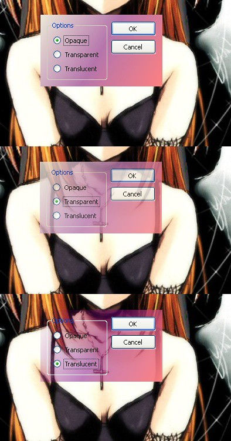

今天开始, 所有的技术文尽量全部用e 文! @@

I don't really know the exact difference between "transparency" and "translucency". But the flowing pictures of my running application may show you.



Pic-1 shows a normal dialog with gradient background filled. Pic-2 add opacity ability to the whole dialog(transparent). While Pic-3 only add opacity to the dialog's background(per-pixel, translucency).

If you're using windows sdk, there's an API called "SetLayeredWindowAttributes" to realize the function in Pic-2. You can also call it with a transparency color key to make all pixels of this color to be transparent. But, how to realize the function in Pic-3? My dialog's background is in gradient color. As mentioned [here](http://gonwan.ycool.com/post.3020701.html)(in Chinese): To realize it, you must use an API called "UpdateLayeredWindow". And it's quite troublesome.

There are also GUI libraries to fill this requirements: 1) WPF, 2) Qt. My application is written in Qt. How do WPF and Qt implement this feature? By drawing all controls themselves. They do not use native windows controls. So if you do it yourself, what a big project !

Using Qt, I call QWidget::setWindowOpacity() to set whole transparency of a window(Pic-2). Qt 4.5 is just released. There's a new translucency attribute in QWidget class. I use it to realize per-pixel alpha blending(Pic-3). Here's Sample code:

```cpp
void TransparentWindow::setTranslucent()
{
    setWindowOpacity(1.0);
    setAttribute(Qt::WA_TranslucentBackground, true);
    repaint();
}
```

The demo project can be found [here](http://cid-481cbe104492a3af.skydrive.live.com/self.aspx/share/dev/TransparentWindow.zip). Note: a) Make sure you have Qt 4.5 installed to build the project. b) The translucent window's type should be set to Qt::FramelessWindowHint.
