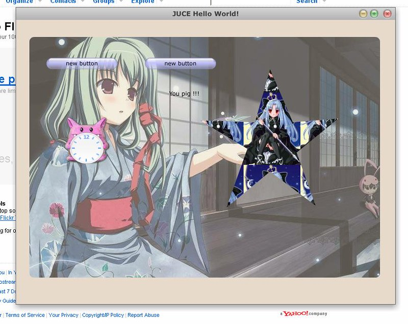

Just take a record. The purpose is to find a GDI+ replacement library.

1. CxImage [http://www.xdp.it/cximage.htm](http://www.xdp.it/cximage.htm) Many image formats are supported. It can be used seamlessly under windows with SDK/MFC. Its main disadvantage is that its support for linux is poor. Version 6.0 does not have linux source packages. While with version 5.99, I can only use it to convert between image formats.

2. FreeImage [http://freeimage.sourceforge.net/](http://freeimage.sourceforge.net/) Like CxImage, is supports many image formats. Since it focus on image shift and manipulation, how to display a image under windows/linux is not issued. There IS a FAQ to tell windows user how to draw images using GDI. But images with alpha channel(like png) is not displayed normally.

3. ImageMagick [http://www.imagemagick.org/](http://www.imagemagick.org/) A console application to manipulate images. It also provides API for programming, but not displaying.

4. cairo [http://cairographics.org/](http://cairographics.org/) It's a powerful cross-platform **graphics** engine. GTK+ use it to render the majority of its widgets. Firefox and SWT/linux also use it. It can be used as a substantiation for GDI+ under windows. But image format support is limited. Only png can be loaded only with this library.

5. DevIL [http://openil.sourceforge.net/](http://openil.sourceforge.net/) Formerly known as "OpenIL" and takes role as a cross-platform image library. It has a high rating at sourceforge. However, I was not able to compile its samples using visual studio. They are broken maybe. Skip.

6. wxWidgets [http://wxwidgets.org/](http://wxwidgets.org/) I wonder why so many excellent image/graphics libraries have insufficient feature. Finally, I found that since a image will be display on a DC(Device Context in GDI) or GC(Graphics Context in X11), a cross-platform display media is also needed. Then I continued to search for light-weight cross-platform GUI libraries and turned to wxWidgets. wxWidgets is simpler than Qt. It can display bmp/jpg/png/tiff images and fills my requirements.

7. Juce [http://www.rawmaterialsoftware.com/juce/index.php](http://www.rawmaterialsoftware.com/juce/index.php) It's a surprise that I finally knew Juce. From Spy++ tool under windows, I found that all controls of the toolkit is drawn by self, say, they do not use native windows controls and do not have handles like Qt. But it's much simpler than Qt and contains a UI designer to generate ready-to-compile C++ code. Here's a demo I created with designer:  You may also see a shadow under the window like Macintosh :) The only issue is that it has a GPL license. haha !
