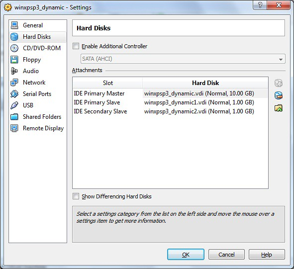
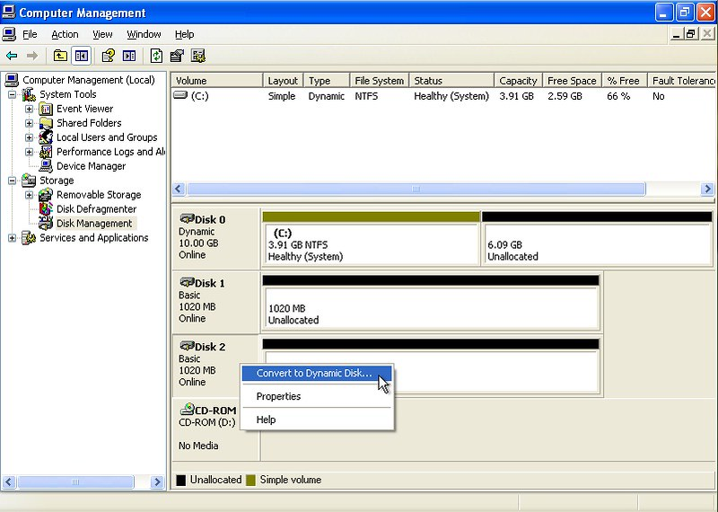
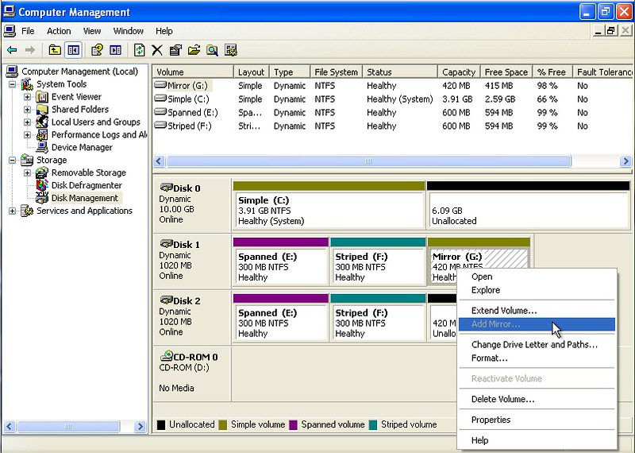
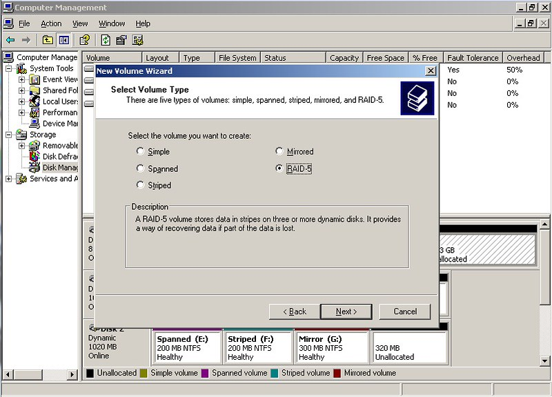
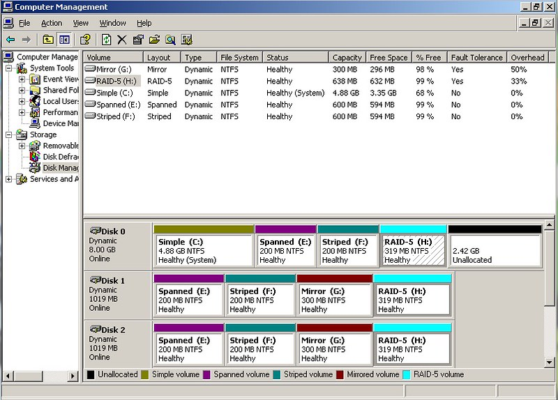

In early days of August, I finished reading the book <\<\windows internals 4e\>\>: [http://www.amazon.com/Microsoft-Windows-Internals-4th-Server/dp/0735619174](http://www.amazon.com/Microsoft-Windows-Internals-4th-Server/dp/0735619174)

There's a concept called dynamic volume. The volume type we commonly used are called basic volume. Basic volumes and dynamic volumes differ in ability to extend storage beyond one physical disk. The basic partitions are confined to one disk and their size is fixed. Dynamic volumes allow to adjust size and to add more free space either from the same disk or another physical disk.

I have done some experiment using dynamic volumes. I used VirtualBox for my virtual machine environment, since it can mount multiple disks.

By default, Windows choose basic volume types for installation. You can convert it manually in "Disk Management" component of MMC.

Then, you can create dynamic volumes of spanned, striped(RAID-0), mirror(RAID-1) and RAID-5 types. For Windows XP, only spanned and striped types are supported.

Here's a screen-shot taken under Windows Server 2003:

Finally, here's my colorful disk volumes:

