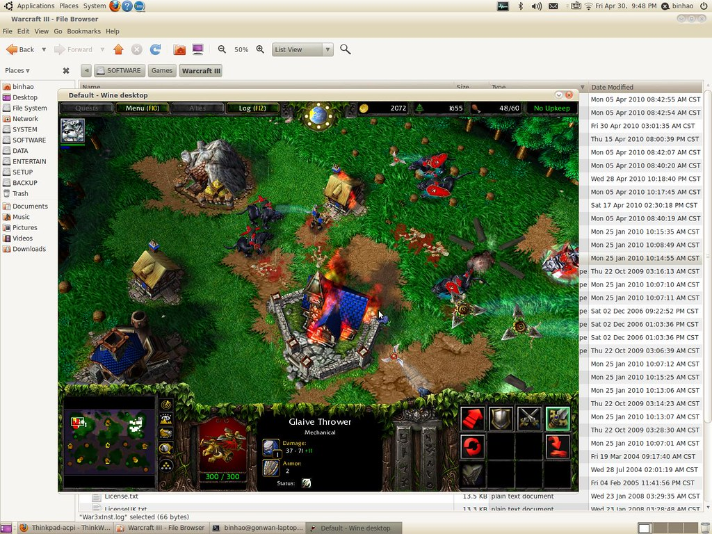

Sorry for leaving this blog outdated for so long. Since go out of [GFW](http://en.wikipedia.org/wiki/Golden_Shield_Project) is not a so easy task.

There's something to mention about installation.

### 0. installation

I installed lucid from harddisk. There's an lock issue when modifying the partition table. We should umount the iso first:

```bash
$ sudo umount -l /isodevice
```

### 1. grub

The original grub installation will not probe Windows OSes. See [here](https://bugs.launchpad.net/ubuntu/+source/ubiquity/+bug/570765). So you must do it manually.

```bash
$ sudo /usr/sbin/grub-mkconfig > /boot/grub/grub.cfg
```

### 2. qterm

The iBus IME issue seems to be fixed in this version. But the "Home" and "End" key do not work correctly. This is a [resolved bug](http://sourceforge.net/tracker/?func=detail&aid=2951516&group_id=79581&atid=557094). So, change the key type to "linux" may workaround.

### 3. emphathy

Pidgin is replaced with emphathy. Emphathy is not as powerful as pidgin. But it integrates better with Gnome's notification area.

### 4. totem/rhythmbox

These are video/audio players. Please install essential codecs. Otherwise, almost nothing could be played and seek function is not available.

```bash
$ sudo apt-get install gstreamer0.10-plugins-bad gstreamer0.10-plugins-bad-multiverse
$ sudo apt-get install gstreamer0.10-plugins-ugly gstreamer0.10-plugins-ugly-multiverse
$ sudo apt-get install libavcodec-extra-52 libavutil-extra-49
```

Now, almost all media formats can be played. Also, media plugins in firefox works.

### 5. fglrx

This is the graphics driver for ATI cards. You may experience better performance and effects. But after I installed it, I could not play Warcraft III using wine. So I reverted to the original default graphics driver, and it works.  To play other 3D games, make sure your have turned off compiz firstly.

### 6. gimp

The gimp is not installed by defaut, so...

### 7. acpid

I'm running on a Thinkpad T60 machine. The brightness function key works correctly, but the volume button does not. Then I found that the hotkey mask should be enabled: [http://swiss.ubuntuforums.org/showthread.php?t=1328016](http://swiss.ubuntuforums.org/showthread.php?t=1328016) [http://www.thinkwiki.org/wiki/thinkpad-acpi](http://www.thinkwiki.org/wiki/thinkpad-acpi) After all, I add following line in the startup script, /etc/rc.local:

```bash
$ cp /sys/devices/platform/thinkpad_acpi/hotkey_all_mask /sys/devices/platform/thinkpad_acpi/hotkey_mask
```

Then the volume button works. The play/pause/stop/prev/next buttons also work in rhythmbox.

### 8. fstab

I want to mount all windows partitions when boot. So /etc/fstab file should be edited automatically using pysdm:

```bash
$ sudo apt-get install pysdm
```

For ntfs partitions, default option is OK. For fat32 partitins, add the "utf8=1" string. Or you may want to edit fstab manually. You can copy from /etc/mtab file and do some little modification. For me, the added modified lines are:

```
# windows partitions
/dev/sda1 /media/SYSTEM ntfs rw,nosuid,nodev,allow_other,default_permissions 0 0
/dev/sda5 /media/SOFTWARE ntfs rw,nosuid,nodev,allow_other,default_permissions 0 0
/dev/sda6 /media/DATA ntfs rw,nosuid,nodev,allow_other,default_permissions 0 0
/dev/sda7 /media/ENTERTAIN ntfs rw,nosuid,nodev,allow_other,default_permissions 0 0
/dev/sda8 /media/SETUP ntfs rw,nosuid,nodev,allow_other,default_permissions 0 0
/dev/sda9 /media/BACKUP vfat rw,nosuid,nodev,uhelper=udisks,uid=1000,gid=1000,shortname=mixed,dmask=0077,utf8=1,flush 0 0
```

### 9. restricted packages

```bash
$ sudo apt-get install ubuntu-restricted-extras
```

This will install some other useful packages. The open-source java packages are included but not necessary. Unmark them and install sun's packages instead.

### 10. modify reserved space

```bash
$ sudo tune2fs -m 3 /dev/sda2
```

### 11. ctrl+alt+backspace

See [here](http://www.ubuntugeek.com/enable-ctrl-alt-backspace-in-ubuntukubuntu-10-04lucid-lynx.html): Since Ubuntu 9.04, the Ctrl-Alt-Backspace key combination to force a restart of X is now disabled by default, to eliminate the problem of accidentally triggering the key combination. In addition, the Ctrl-Alt-Backspace option is now configured as an X keymap (XKB) option, replacing the X server "DontZap" option and allowing per-user configuration of this setting.

As a result, enabling or disabling the Ctrl+Alt+Backspace shortcut can now be done easily from the desktop.
- Enabling Ctrl-Alt-Backspace for Ubuntu 10.04
  - Select "System" -> "Preferences" -> "Keyboard".
  - Select the "Layouts" tab and click on the "Layout Options" button.
  - Select "Key sequence to kill the X server" and enable "Control + Alt + Backspace".
- Enabling Ctrl-Alt-Backspace for Kubuntu 10.04
  - Click on the Application launcher and select "System Settings".
  - Click on "Regional & Language".
  - Select "Keyboard Layout".
  - Click on "Enable keyboard layouts" (in the Layout tab).
  - Select the "Advanced" tab. Then select "Key sequence to kill the X server" and enable "Control + Alt + Backspace".
