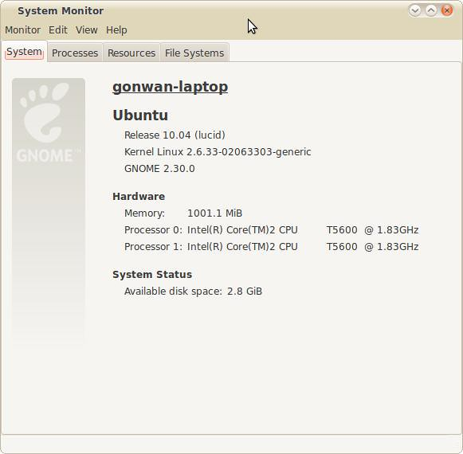

Today, I updated my kernel using the official `*.deb` file to 2.6.33.3. This may be the easiest way: [http://kernel.ubuntu.com/~kernel-ppa/mainline/v2.6.33.3-lucid/](http://kernel.ubuntu.com/~kernel-ppa/mainline/v2.6.33.3-lucid/). Since 2.6.33 supports DRM natively, my update was so smoothly.

In the later 2 blogs, I want to learn and write down how to compile kernel from ubuntu source and original kernel source.
