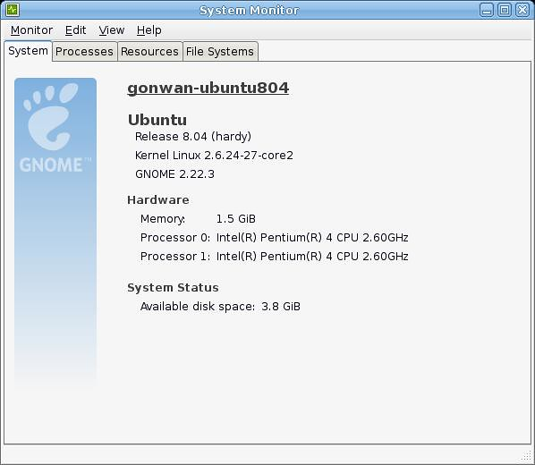

Hardy(8.04) is a little different from all the other versions when building a kernel. Only Hardy has two packages for kernel installation: linux-image, linux-ubuntu-modules. If you do not install the latter one, your sound card and network card will can not be recognized. Today, I built the kernel from the ubuntu source(not the original kernel source). So, I could use the including debian scripts for convenience. Here's the steps:

1. Tools:

```bash
$ sudo apt-get install build-essential fakeroot linux-kernel-devel kernel-wedge
```

2. Sources:

The source will be downloaded in the current directory.

```bash
$ sudo apt-get source linux-source-2.6.24
$ sudo apt-get source linux-ubuntu-modules-2.6.24
```

3. Customize:

cd into "linux-2.6.24" root.

I selected "core2" as my custom name.

```bash
$ cp debian/control.d/vars.generic debian/control.d/vars.core2
$ cp debian/abi/2.6.24-27.68/i386/generic debian/abi/2.6.24-27.68/i386/core2
$ cp debian/abi/2.6.24-27.68/i386/generic.modules debian/abi/2.6.24-27.68/i386/core2.modules
$ cat debian/config/i386/config debian/config/i386/config.generic > debian/config/i386/config.core2
```

Then patch some files:

- debian/scripts/misc/getabis:
  - From: getall i386 386 generic server virtual
  - To: getall i386 386 generic server virtual core2

- debian/rules.d/i386.mk:
  - From: flavours = 386 generic
  - To: flavours = 386 generic core2

4. Build:

```bash
$ fakeroot debian/rules clean
$ CONCURRENCY_LEVEL=2 AUTOBUILD=1 NOEXTRAS=1 skipabi=true fakeroot debian/rules binary-core2
```

If you get errors like:

```
> /home/gonwan/Documents/linux-2.6.24 is not clean, please run 'make mrproper'
> in the '/home/gonwan/Documents/linux-2.6.24' directory.
```

Run the following command, it is issued by the Makefile:

```bash
$ rm -rf .config include/config
```

5. Done:

My PC has a P4-2.6c CPU. It took about 90 minutes to finish. The kernel also consumed about 2G storage. After all, three `*.deb` files were generated:
- linux-headers-2.6.24-27-core2_2.6.24-27.69_i386.deb
- linux-image-2.6.24-27-core2_2.6.24-27.69_i386.deb
- linux-image-debug-2.6.24-27-core2_2.6.24-27.69_i386.deb

6. Customize modules:

First, generate prepare scripts:

```bash
$ cat debian/config/i386/config debian/config/i386/config.generic > .config
$ make prepare scripts
```

cd into "linux-ubuntu-modules-2.6.24-2.6.24"

```bash
$ cp debian/control.d/vars.generic debian/control.d/vars.core2
```

Note: Custom modules name must match the custom kernel name, say "core2".

Then patch some files:

- debian/rules.d/i386.mk:
  - From: flavours = 386 generic
  - To: flavours = 386 generic core2
- debian/rules.d/0-common-vars.mk (To prevent error in build step, debian/rules.d/3-udebs.mk):
  - From: disable_d_i = no
  - To: disable_d_i = true

Now generate new debian/control, which includes new custom kernel:

```bash
$ rm debian/control.stub
$ debian/rules debian/control.stub
```

7. Build modules:

```bash
$ AUTOBUILD=1 fakeroot debian/rules binary-arch arch=i386 flavours=core2 KDIR=/home/gonwan/Documents/linux-2.6.24
```

8. Done again:

This time, it took 30 minutes and consumed 300M storage. Two `*.deb` files were built:
- linux-headers-lum-2.6.24-27-core2_2.6.24-27.45_i386.deb - linux-ubuntu-modules-2.6.24-27-core2_2.6.24-27.45_i386.deb

9. Install kernel:

Just double-click or install using the dpkg utility. Here's my screen-shot:



10. Reference:

- [https://help.ubuntu.com/community/Kernel/Compile](https://help.ubuntu.com/community/Kernel/Compile)
- [http://blog.avirtualhome.com/2009/09/08/how-to-compile-a-kernel-for-ubuntu-jaunty-revised/](http://blog.avirtualhome.com/2009/09/08/how-to-compile-a-kernel-for-ubuntu-jaunty-revised/)
- [http://ubuntuforums.org/showthread.php?t=912322](http://ubuntuforums.org/showthread.php?t=912322)
