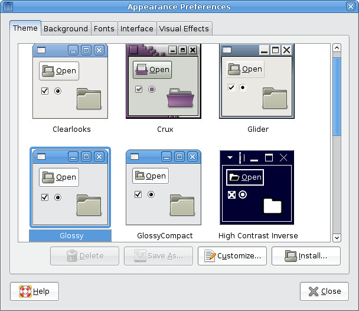
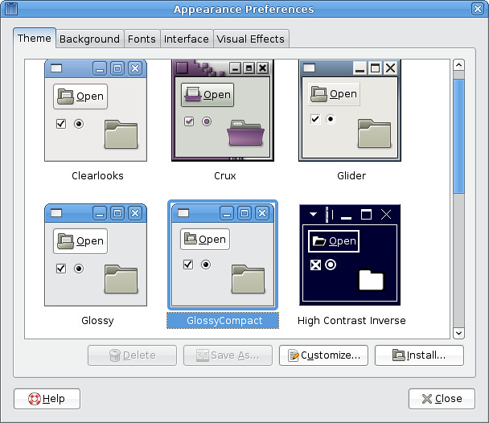

Refer to: [http://martin.ankerl.com/2008/10/10/how-to-make-a-compact-gnome-theme/](http://martin.ankerl.com/2008/10/10/how-to-make-a-compact-gnome-theme/)

I chosen the Glossy theme and made a compact one. I tried to make smallest changes and it was enough.

```bash
$ sudo cp -r /usr/share/themes/Glossy/ /usr/share/themes/GlossyCompact/
$ cd /usr/share/themes/GlossyCompact/
$ sudo gedit index.theme
```

Modify the name and comments, save.

```bash
$ sudo gedit gtk-2.0/gtkrc
```

Add the following line:

```
gtk-icon-sizes = "panel-menu=20,20:gtk-menu=16,16:gtk-button=16,16:gtk-small-toolbar=16,16:gtk-large-toolbar=20,20:gtk-dnd=32,32:gtk-dialog=32,32"
```

Ok, now let's compare the result:




