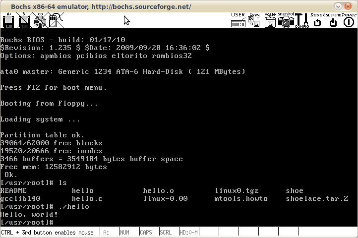

Old kernels have less code. So They are easier to learn and understand. I follow the instructions here: [http://www.oldlinux.org/](http://www.oldlinux.org/). You can also download the eBook in the website(In Chinese).

I managed to run the kernel in Hardy(8.04) and Lucid(10.04) using Bochs simulator. In Ubuntu, you may install it by typing:

```bash
$ sudo apt-get install bochs bochs-x bochsbios vgabios
```

To compile the source, you may also want to install the assembler:

```bash
$ sudo apt-get install bin86
```

I downloaded the source here: [http://www.oldlinux.org/Linux.old/kernel/0.1x/linux-0.11-040327-rh9.tar.gz](http://www.oldlinux.org/Linux.old/kernel/0.1x/linux-0.11-040327-rh9.tar.gz). But it works only in RedHat 9(RHEL3, CentOS3) with gcc-3.2 and bochs-2.2. Then I patched the source code with the help of google. Finally, it compiled under gcc-4.1/gcc-4.2 and ran happily. Due to optimization issues, gcc-4.3 and above build the wrong kernel. I do not know how to solve this. I also downloaded the Bochs harddisk image here: [http://oldlinux.org/Linux.old/bochs/linux-0.11-devel-060625.zip](http://oldlinux.org/Linux.old/bochs/linux-0.11-devel-060625.zip).

You may encounter syntax error using the including bochs configure file. Refer to a sample one found in /usr/share/doc/bochs/examples/bochsrc.gz. Basically, you should specify the image path of your floppy(kernel image) and harddisk like:

```
floppya: 1_44="./linux-0.11-gcc4.1/Image", status=inserted
ata0-master: type=disk, path="./linux-0.11-devel-060625/hdc-0.11-new.img", mode=flat, cylinders=410, heads=16, spt=38
```

Then make sure the boot option is:

```
boot: floppy
```

Now let's see the screenshot when running the classic kernel:


