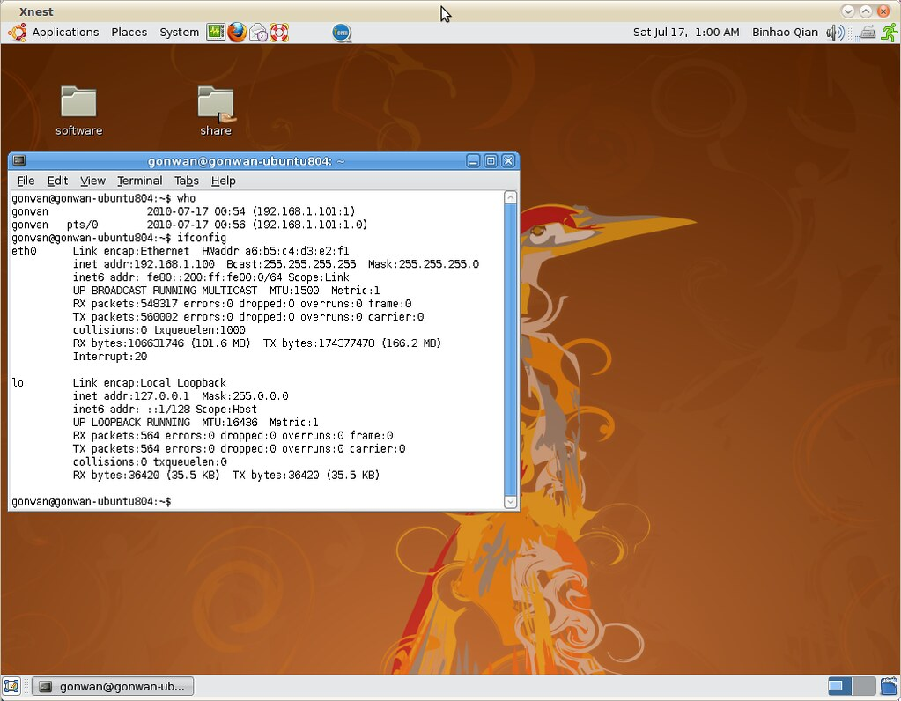

In company, I use VNC to control remote machines. But in GDM stage, this does not work. Maybe VNC server in Ubuntu is a service in Gnome session. The solution is to use XDMCP(X Display Manager Control Protocol). Using Ubuntu, "xnest" package should be installed on both server and client side. It's a nested X server that simply relays all its requests to another X server, where it runs as a client:

```bash
$ sudo apt-get install xnest
```

In server side,  go to System --> Administration --> Login Window, or simply run "gdmsetup". Go to "Remote" tab, set value to "Same as Local".

In client side, go to Applications --> Internet --> Terminal Server Client, or simply run "tsclient". You'll find the XDMCP protocol type can be selected now. Enter your server address to connect.

Here's my screenshot. The output of command "who" and "ifconfig" had different IP addresses:



Since xnest sends and receive all X Server data, it consumes a lot of bandwith. On my laptop using wireless networking, it's somewhat slow.
