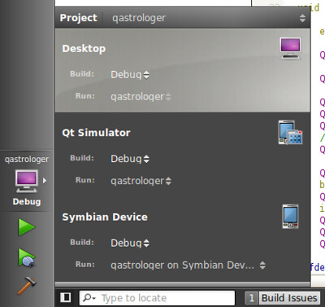

This article borrows hugely from: [http://labs.qt.nokia.com/2010/12/17/experimental-packages-for-symbian-development-on-linux/](http://labs.qt.nokia.com/2010/12/17/experimental-packages-for-symbian-development-on-linux/)

First, there's Qt SDK and Nokia Qt SDK. In a word, Qt SDK is for desktop development, while Nokia Qt SDK is for mobile development. A detailed comparison can be found [here](http://qt.nokia.com/products/qt-for-mobile-platforms#qtfornokia).

Then, there's S60 SDK. Is it necessary to install it before developing symbian applications? The S60 SDK is only available under Windows platform. Under Windows, Nokia Qt SDK is an all-in-one package. It includes S60 SDK, Qt SDK, QtSimulator and a Symbian compiler. So, the AIO package is recommended. There's another choice under Windows: S60 SDK + Qt for Symbian. The Symbian version can be found [here](http://qt.nokia.com/downloads/symbian-cpp). But this time, there's no simulator.

As mentioned [here](http://labs.qt.nokia.com/2010/11/09/qt-4-7-1-released/), These two SDK will be merged in Nokia Qt SDK 1.1.

Now, we will have our Linux tutorial for Ubuntu.

1. Download and install the following packages (32-bit versions only): \* [gcce-4.4.172-r1.deb](http://pepper.troll.no/s60prereleases/linux-packages/gcce-4.4.172-r1.deb) \* [s60-sdk-5.0.deb](http://pepper.troll.no/s60prereleases/linux-packages/s60-sdk-5.0.deb) \* [runonphone-4.7.1.deb](http://pepper.troll.no/s60prereleases/linux-packages/runonphone-4.7.1.deb) \* [qt-symbian-libs-4.7.1-r1.deb](http://pepper.troll.no/s60prereleases/linux-packages/qt-symbian-libs-4.7.1-r1.deb) (Old version: [qt-symbian-libs-4.7.1.deb](http://pepper.troll.no/s60prereleases/linux-packages/qt-symbian-libs-4.7.1.deb))

2. Install App TRK on your phone. It's a debug service. Find \*.sisx files [here](http://tools.ext.nokia.com/trk/). Check the TRKPackages.xml file to get correct version for your phone. For my C5-03, I used s60_5_0_app_trk_3_2_7.sisx.

3. Install Qt libs for Symbian. They can be found at Qt's ftp site: [ftp://ftp.qt.nokia.com/pub/qt/symbian/](ftp://ftp.qt.nokia.com/pub/qt/symbian/). I installed version 4.7.1 as the developing library. Here's what exactly each \*.sis package contains:

> \* fluidlauncher.sis Contains around 10 different Qt demos. Depends on Qt and Open C. \* qt.sis Contains the Qt libraries Symbian Signed for Nokia phones. Depends on Open C. \* qt_selfsigned.sis A self-signed version of the above library. Works on other phones such as the Samsung i8910. \* qtwebkit.sis Contains the QtWebKit library Symbian Signed for Nokia phones. Depends on Qt. \* qtwebkit_selfsigned.sis A self-signed version of the above library. Works on other phones such as the Samsung i8910. \* qt_demos.sis Contains qt.sis, qtwebkit.sis, fluidlauncher.sis and Open C all in one convenient package. No other dependencies. \* qt_installer.sis Contains qt.sis, qtwebkit.sis and Open C all in one convenient package. No other dependencies.

Installing qt_installer.sis is enough.

4. Configure your QtCreator, add QtSimulator and QtSymbian versions. The Qt4 page should be something like:


5. Now, create a simple GUI application and add desktop/simulator/device targets, so that you can run on all of them. 

6. Run on phone.

When App TRK is installed, connect the phone to the PC using the USB cable. Select "PCSuite" as connection type. Then run App TRK on the phone, and make sure that the connection type is USB. This can be changed under the Settings menu entry. If necessary, choose Connect from the menu.

On Linux, phone should appear as the /dev/ttyUSB1 device, however if you are running an old kernel, you may need to force the USB module to be loaded correctly before the device will appear:

```bash
$ lsusb
```

Note the identifier on the line where your Symbian device appears. Then execute the following, using the first and second part of the identifier in place of XXX, respectively.

```bash
$ sudo rmmod usbserial
$ sudo modprobe usbserial vendor=0x0XXX product=0x0XXX
```

For my C5-03, It's:

```bash
$ sudo modprobe usbserial vendor=0x0421 product=0x03e6
```

The rmmod step may fail if the module is not already loaded, but that is harmless.

In QtCreator, go to Projects --> Targets --> Symbian Device, refresh the serial port, select USB1 and connect to your phone.


Congratulations! you've done. Select Symbian device as your target and click run button. This will package, deploy and run your application on your phone. Simple, Huhhh?
