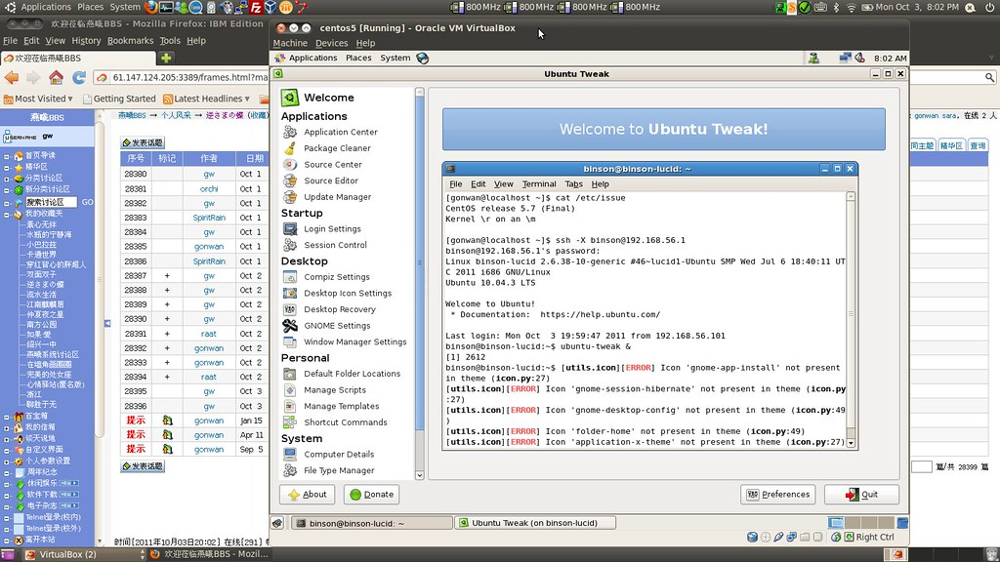

First, you should install a SSH server:

```bash
# centos 5.7
$ yum install openssh-server
# ubuntu 10.04
$ sudo apt-get install openssh-server
```

The configure files are located in `/etc/ssh/sshd_config`. The default ones are OK.

Now connect your server by command below. The -X flag enables X11 forwarding, through which a user can access the local X11 display:

```bash
$ ssh -X @
```

I use Ubuntu as host, and CentOS as guest in VirtualBox. The default `NAT` network mode does not allow you to access a guest from host. I just change the network mode to *Host-only Network*, and the problem is solved.

Here gives a screenshot: ubuntu-tweak is running on CentOS:


