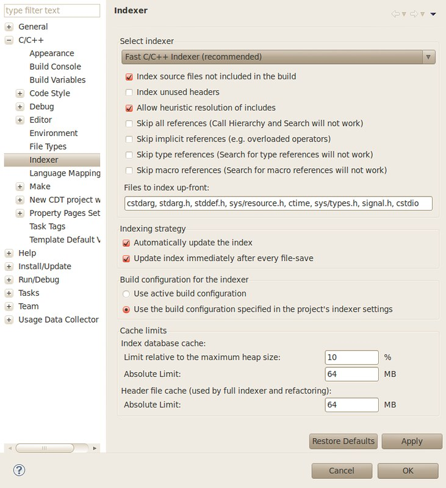
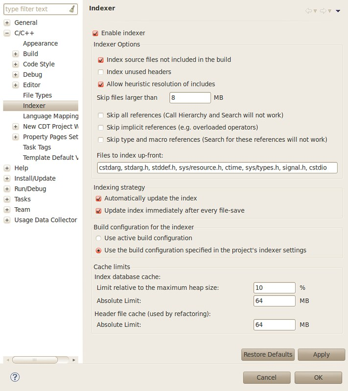
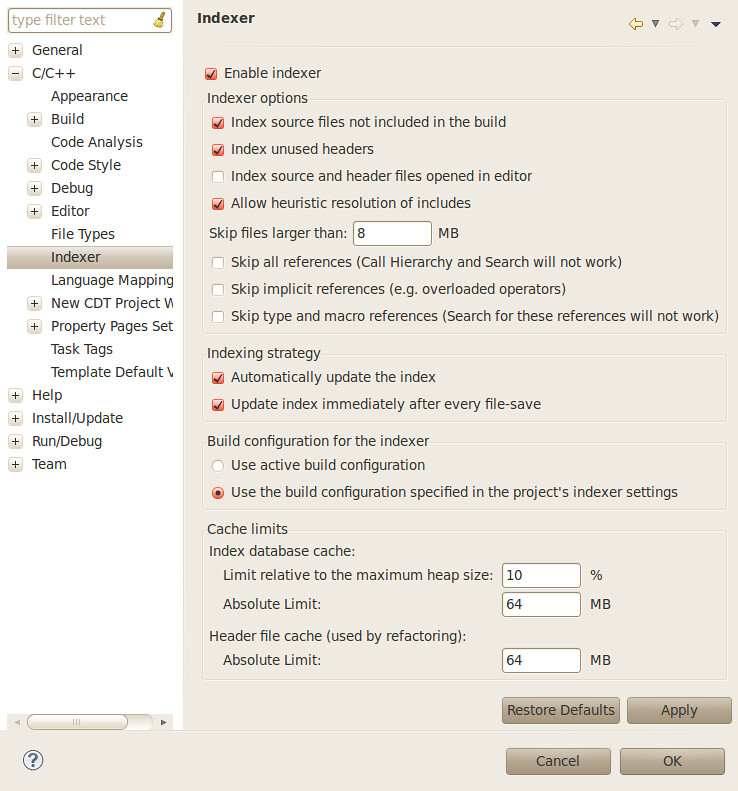

First, here's the original indexer preference page of eclipse 3.5 (CDT 6.0):

In eclipse 3.6 (CDT 7.0), the full indexer is [removed](https://bugs.eclipse.org/bugs/show_bug.cgi?id=294864) in favour of the fast indexer.

And in eclipse 3.7 (CDT 8.0), there seems to be no big changes, "Index source and header files opened in editor" is added and set to false by default:

Now, here's the indexer preference page of eclipse 3.8/4.2 (CDT 8.1). Two changes: 1) [Bug 197989](https://bugs.eclipse.org/bugs/show_bug.cgi?id=197989) - Headers included in different variants are not supported. 2) [Bug 377992](https://bugs.eclipse.org/bugs/show_bug.cgi?id=377992) - Enable the "Index unused headers" preference by default. In addition, option to parse files up-front from UI is [removed](http://git.eclipse.org/c/cdt/org.eclipse.cdt.git/commit/?id=0fb12d7d561551926f0dfa07fc5d8803407efb35).

I just want to read source code of [apr](http://apr.apache.org/) and [glib](http://developer.gnome.org/glib/stable/), to learn from them. When I created a C project and imported all files into it, some symbols were unresolved or wrongly resolved. In eclipse 3.7/3.8 (CDT 8.0/8.1), I managed to work it out by importing only unix-specific source files.

There's a [performance issue](https://bugs.eclipse.org/bugs/show_bug.cgi?id=385272) in eclipse Juno 4.2, but Juno 3.8 is not affected. So I strongly suggest to use [3.8](http://download.eclipse.org/eclipse/downloads/eclipse3x.html) version. Since there's no all-in-one package for 3.8. It is suggested to download the platform package (not the huge SDK package), and install CDT online.
