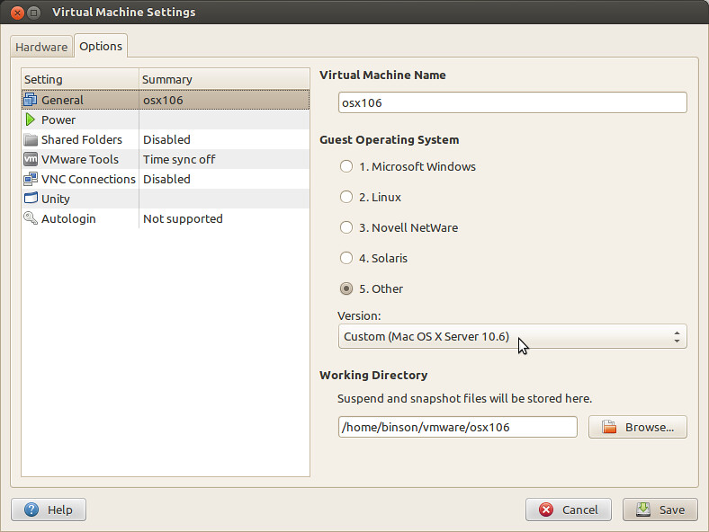
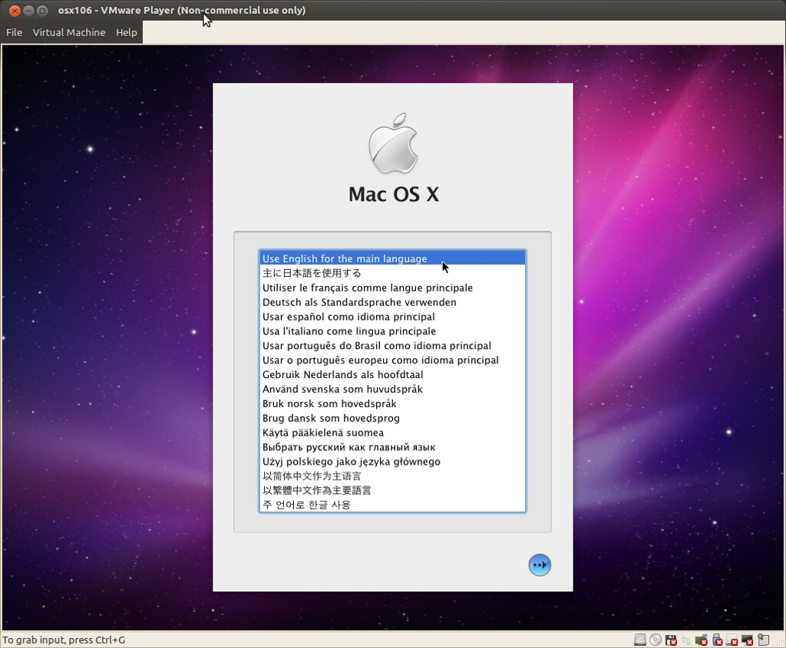
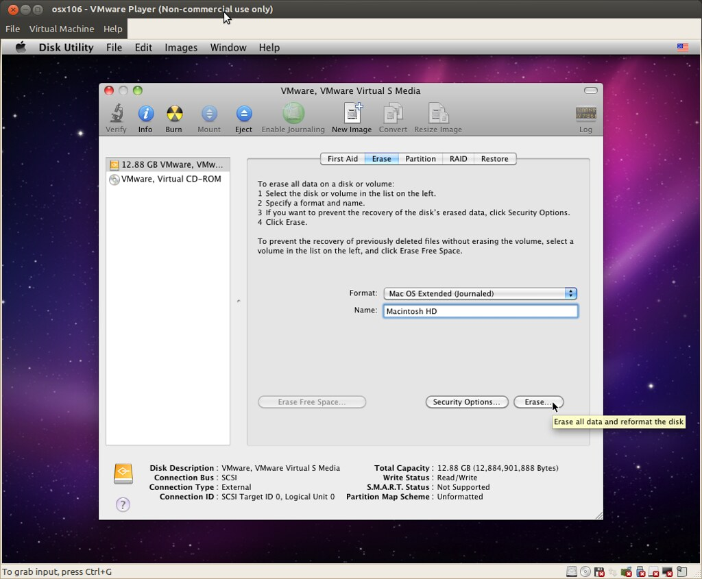
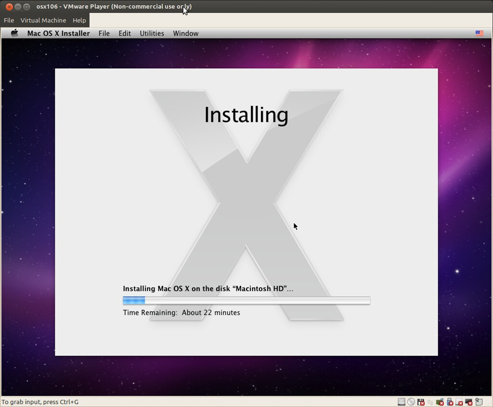
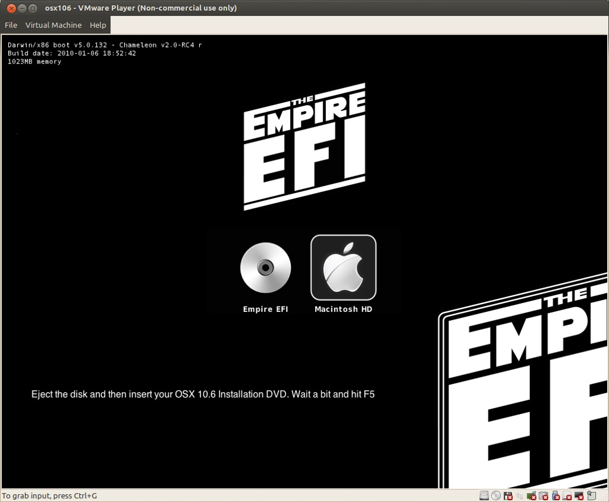
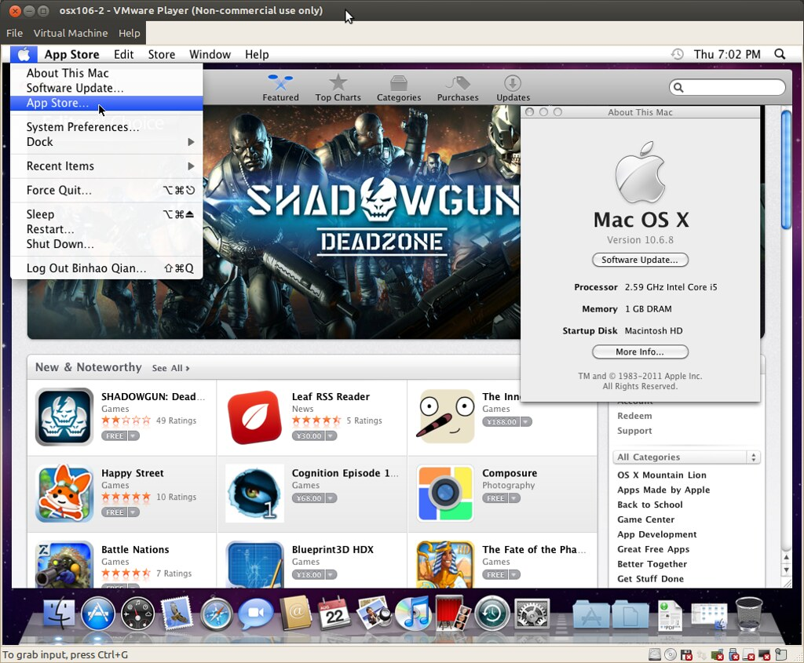

Macintosh really has a fantastic UI. I once installed OSX 10.3 successfully using [pearpc](http://pearpc.sourceforge.net/), but it was awfully slow, since it need to emulate PowerPC via software layer. And now, I just successfully installed OSX 10.6 Snow Leopard in VMware player 5.0.2. The equivalent workstation version is 9.0.2. I tried [virtualbox](http://www.virtualbox.org/), but it just did not work. Now, please follow my steps:

1. Create a new VM and select the OS type as "FreeBSD".

2. Close the VMware player. Open the \*.vmx file find the line:

```
guestOS = "freebsd"
```

Change to:

```
guestOS = "darwin10"
```

Start VMware player again. The OS type is now set to "Mac OSX 10.6 Server":



3. Modify VM: set Memory to 1G, check "Accelerate 3D Graphics". Now, here's the most **_important_** step: Remove your existing hard disk, and add a new one, but choose SCSI as the virtual disk type. Change the CD/DVD device to also use SCSI type via the "Advanced" button. Without these steps, you will encounter the famous "still waiting for root device" error. Seems OSX cannot handle IDE devices correctly. :(


4. I used EmpireEFI v1085 to boot and install OSX 10.6, please find both images for your own. When EmpireEFI boots finishes, mount the OSX 10.6 image and press F5 to refresh. VMware player 5.0.2 supports \*.dmg file directly, please select all files to find the image:


5. Here we go, just press enter and you will be booted into OSX installer:



6. If the disk drive doesn't appear under "Select the disk where you want to Install Mac OSX", go to menu Utility --> Disk Utilities and erase the whole disk:



7. The disk should now appear. You may want to customize the installation by clicking the button in left-bottom corner. Then let's move on:



8. When finished, the system will reboot automatically. And it will fail. We must still use EmpireEFI to boot. But we select to boot OSX this time:



9. After some simple configuration, you will finally have your OSX desktop. Cheers!


**Updated Aug 23:** The EmpireEFI did not work after I upgraded to 10.6.8. Kernel panic appeared like:

```
This symbol set has the following unresolved symbols:
```

I used iBoot 3.3 to replace EmpireEFI, and booted successfully.



You will have App Store(available in 10.6.6+) in your menu after upgrade. I also installed Xcode 3.2.6 which can still be downloaded from Apple. It requires 10.6.6 too.
