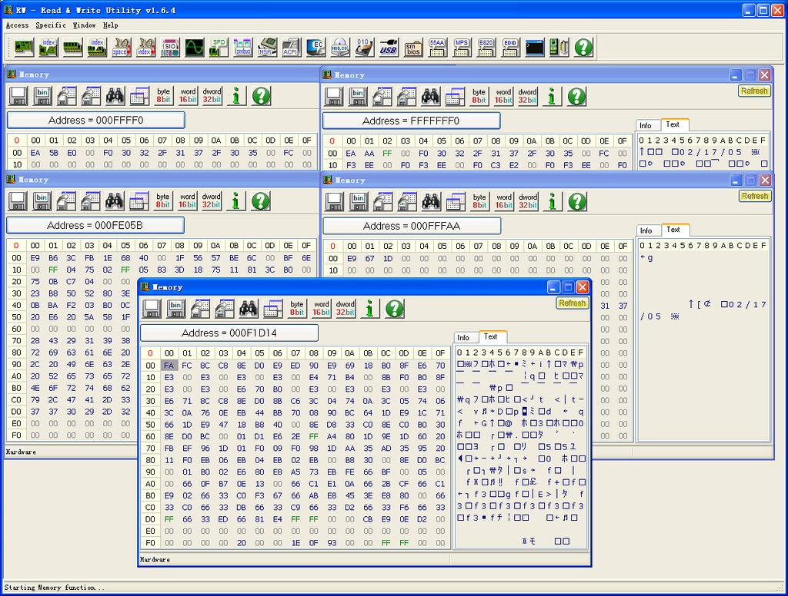
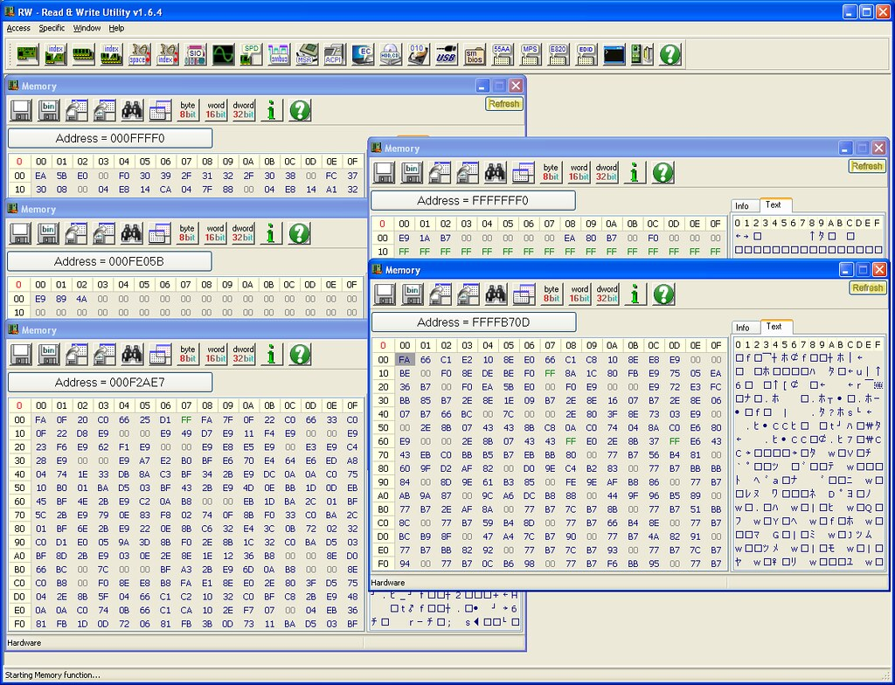

First, from [Intel's manuals](http://www.intel.com/content/www/us/en/processors/architectures-software-developer-manuals.html) 3A 9.1.4:

> The first instruction that is fetched and executed following a hardware reset is located at physical address FFFFFFF0H. This address is 16 bytes below the processor's uppermost physical address. The EPROM containing the software-initialization code must be located at this address.
> 
> The address FFFFFFF0H is beyond the 1-MByte addressable range of the processor while in real-address mode. The processor is initialized to this starting address as follows. The CS register has two parts: the visible segment selector part and the hidden base address part. In real-address mode, the base address is normally formed by shifting the 16-bit segment selector value 4 bits to the left to produce a 20-bit base address. However, during a hardware reset, the segment selector in the CS register is loaded with F000H and the base address is loaded with FFFF0000H. The starting address is thus formed by adding the base address to the value in the EIP register (that is, FFFF0000 + FFF0H = FFFFFFF0H).
> 
> The first time the CS register is loaded with a new value after a hardware reset, the processor will follow the normal rule for address translation in real-address mode(that is, [CS base address = CS segment selector \* 16]). To insure that the base address in the CS register remains unchanged until the EPROM based software-initialization code is completed, the code must not contain a far jump or far call or allow an interrupt to occur (which would cause the CS selector value to be changed).

Two screenshots showing instructions in address FFFFFFF0H and FFFF0H(Shadow BIOS, see below) and their jumps. The first one is showing a AMI BIOS, while the second Phoenix BIOS. High BIOS of AMI directly jumps to the shadowed one, and both high and shadowed one jump to the same address. But High BIOS of Phoenix just keeps running in high addresses. The first instruction of both BIOS after all jumps is FAh, say cli(disable interrupts). I'm not going to do more reverse engineering. :)  

**NOTE**: Main memory is not initialized yet at this time. From [here](http://duartes.org/gustavo/blog/post/how-computers-boot-up):

> The motherboard ensures that the instruction at the reset vector is a jump to the memory location mapped to the BIOS entry point. This jump implicitly clears the hidden base address present at power up. All of these memory locations have the right contents needed by the CPU thanks to the memory map kept by the chipset. They are all mapped to flash memory containing the BIOS since at this point the RAM modules have random crap in them.

The reset vector is simply FFFFFFF0h. Now, [POST](http://en.wikipedia.org/wiki/Power-on_self-test) is started as described [here](http://www.bioscentral.com/misc/biosbasics.htm):

> POST stands for Power On Self Test. It's a series of individual functions or routines that perform various initialization and tests of the computers hardware. BIOS starts with a series of tests of the motherboard hardware. The CPU, math coprocessor, timer IC's, DMA controllers, and IRQ controllers. The order in which these tests are performed varies from motherboard to motherboard. Next, the BIOS will look for the presence of video ROM between memory locations C000:000h and C780:000h. If a video BIOS is found, It's contents will be tested with a checksum test. If this test is successful, the BIOS will initialize the video adapter. It will pass controller to the video BIOS, which will inturn initialize itself and then assume controller once it's complete. At this point, you should see things like a manufacturers logo from the video card manufacturer video card description or the video card BIOS information. Next, the BIOS will scan memory from C800:000h to DF800:000h in 2KB increments. It's searching for any other ROM's that might be installed in the computer, such as network adapter cards or SCSI adapter cards. If a adapter ROM is found, it's contents are tested with a checksum test. If the tests pass, the card is initialized. Controller will be passed to each ROM for initialization then the system BIOS will resume controller after each BIOS found is done initializing. If these tests fail, you should see a error message displayed telling you "XXXX ROM Error". The XXXX indicates the segment address where the faulty ROM was detected. Next, BIOS will begin checking memory at 0000:0472h. This address contains a flag which will tell the BIOS if the system is booting from a cold boot or warm boot. A value of 1234h at this address tells the BIOS that the system was started from a warm boot. This signature value appears in Intel little endian format, that is, the least significant byte comes first, they appear in memory as the sequence 3412. In the event of a warm boot, the BIOS will will skip the POST routines remaining. If a cold start is indicated, the remaining POST routines will be run.

**NOTE**: Main memory is initialized in POST. Main part of memory initialization code is complicated, and is directly provided by Intel which is known as [MRC](http://en.wikipedia.org/wiki/Memory_Reference_Code)(Memory Reference Code).

There's one step in POST called BIOS [Shadowing](http://www.rigacci.org/docs/biblio/online/firmware/shadow.htm):

> Shadowing refers to the technique of copying BIOS code from slow ROM chips into faster RAM chips during boot-up so that any access to BIOS routines will be faster. DOS and other operating systems may access BIOS routines frequently. System performance is greatly improved if the BIOS is accessed from RAM rather than from a slower ROM chip.

A DRAM control register PAM0(Programmable Attribute Map) makes it possible to independently redirect reads and writes in the BIOS ROM area to main memory. The idea is to allow for RAM shadowing which allows read-access for ROMs to come from main memory whereas writes will continue to go to ROMs. Refer to Intel's MCH datasheet for details:

> This register controls the read, write, and shadowing attributes of the BIOS area from 0F0000h–0FFFFFh. The (G)MCH allows programmable memory attributes on 13 Legacy memory segments of various sizes in the 768 KB to 1 MB address range. Seven Programmable Attribute Map (PAM) Registers are used to support these features. Cacheability of these areas is controlled via the MTRR registers in the processor.

Big real mode(or [unreal mode](http://en.wikipedia.org/wiki/Unreal_mode)) is used to address more memory beyond 1M, as BIOS ROMs becomes larger and larger. In big real mode, one or more data segment registers have been loaded with 32-bit addresses and limits, but code segment stays unchanged:

|  | Real Mode | Big Real Mode | Protected Mode |
| --- | --- | --- | --- |
| Code segment(cs) | 1M | 1M | 4G |
| Data segments(ds, es, fs, gs) | 1M | 4G | 4G |

Protected mode can also refer 4G memory. But BIOS is mainly written for real mode, big real mode is a better choice for addressing.

Then, BIOS continues to  find a bootable device, see [wikipedia](http://en.wikipedia.org/wiki/BIOS):

> The BIOS selects candidate boot devices using information collected by POST and configuration information from EEPROM, CMOS RAM or, in the earliest PCs, DIP switches. Option ROMs may also influence or supplant the boot process defined by the motherboard BIOS ROM. The BIOS checks each device in order to see if it is bootable. For a disk drive or a device that logically emulates a disk drive, such as a USB Flash drive or perhaps a tape drive, to perform this check the BIOS attempts to load the first sector (boot sector) from the disk to address 7C00 hexadecimal, and checks for the boot sector signature 0x55 0xAA in the last two bytes of the sector. If the sector cannot be read (due to a missing or blank disk, or due to a hardware failure), or if the sector does not end with the boot signature, the BIOS considers the disk unbootable and proceeds to check the next device. Another device such as a network adapter attempts booting by a procedure that is defined by its option ROM (or the equivalent integrated into the motherboard BIOS ROM). The BIOS proceeds to test each device sequentially until a bootable device is found, at which time the BIOS transfers control to the loaded sector with a jump instruction to its first byte at address 7C00 hexadecimal (1 KiB below the 32 KiB mark).

After all of above, BIOS initialization is finished. It's your turn to take control of your system from address 0000:7c00!!

Why this address? It's not defined by Intel nor Microsoft. It was decided by IBM PC 5150 BIOS developer team([David Bradley](http://en.wikipedia.org/wiki/David_Bradley_%28engineer%29)). See [here](http://www.glamenv-septzen.net/en/view/6):

> BIOS developer team decided 0x7C00 because:
> 
> - They wanted to leave as much room as possible for the OS to load itself within the 32KB. - 8086/8088 used 0x0 - 0x3FF for interrupts vector, and BIOS data area was after it. - The boot sector was 512 bytes, and stack/data area for boot program needed more 512 bytes. - So, 0x7C00, the last 1024B of 32KB was chosen.
