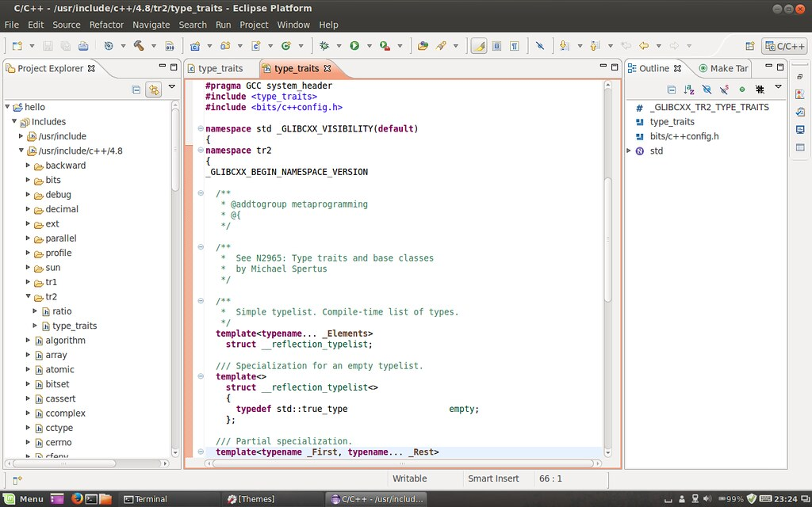

Finally switched from Ubuntu to Linuxmint after the 14.04 release. The distribution installed so many packages that I would never use, and the Unity desktop rendered slow on my old thinkpad :(

After trying Linuxmint 17 in VirtualBox, I found the color of its default theme is not so good. The mixture of grey and light green, sometimes made it a bit hard to detect borders. It also made me feel comfortless when using eclipse:


So I managed to reuse the default theme of Ubuntu within the cinnamon desktop from Linuxmint:



Here's what I did:

```bash
$ sudo apt-get install light-themes
```

This installs the Ubuntu themes. Now edit the theme to add support for Nemo:

```bash
$ cd /usr/share/themes/Ambiance/gtk-3.0/
$ sudo vi gtk-main.css
```

Add one line to the end of the file:

```css
@import url("apps/nemo.css");
```

Create the new nemo.css file:

```bash
$ sudo cp apps/nautilus.css apps/nemo.css
$ sudo vi apps/nemo.css
```

Replace all "nautilus" with "nemo", "Nautilus" with "Nemo":

```
:%s/nautilus/nemo/g
:%s/Nautilus/Nemo/g
```

**Updated Aug 14:** Alternative color in Nemo is not available. It seems to be a bug([LP#945430](https://bugs.launchpad.net/light-themes/+bug/945430)) in the ubuntu theme.

Now open your "Themes" configuration, go to "Other settings" tab. Set "Controls" to "Ambiance", set "Icons" to "ubuntu-mono-dark", set "Window borders" to "Ambiance".
