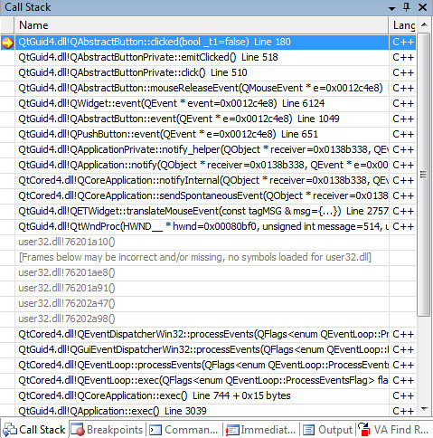

> This is a repost from my previous Qt learning series, based on Qt 4.3.

    今天说一下Qt的事件处理(event processing)机制.

    我们之前已经用过了, 当一个`QPushButton`被点击的时候, 它的`clicked()` signal就会被emit, 这还是一个signal/slot的关系. 那么Qt中的event到底是干嘛的呢?
    书上有这么一句话: *As a rule, signals are useful when using a widget, whereas events are useful when implementing a widget.* 也就是说一般的话, 调用signal就可以了, 如果要自定义控件, 那么还是需要用到event的. Qt的event相当于系统native的事件的抽象. 比如windows的话就是对应于message.
    还是根据源码来剖析event和signal的关系. 下图是点击了一个`QPushButton`之后的call stack:

    从`QApplication::notify()`开始, 然后是`QPushButton::event()`函数, 其中分别调用父类`QAbstractButton:event()`, `QWidget::event()`. 最后这个event被dispatch到`QAbstractButton::mouseReleaseEvent()`, 在这个函数中, 被判定为click了这个`QButton`, 即调用`QAbstractButtonPrivate::click()`函数. 最后再在这个函数中调用`QAbstractButtonPrivate::emitClicked()`函数来emit `QAbstractButton::clicked()`这个signal.
    所以说, event实际上是singal/slot的底层实现.
