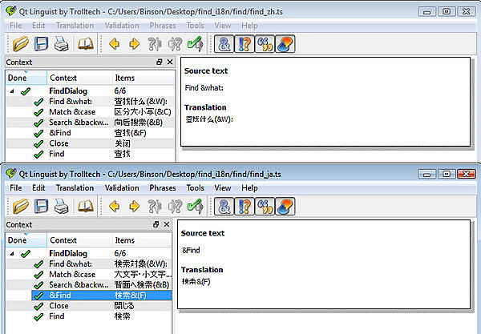
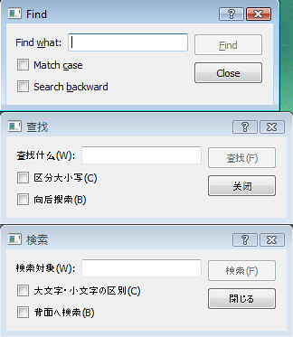

> This is a repost from my previous Qt learning series, based on Qt 4.3.

    本篇说一下Qt所谓的高级特性: i18n 的支持 (Internationalization).
    首先明确一点, Qt对于unicode的支持是相当好的, 用来表示字符串的`QString`保存的是16-bit的`QChar`(官方文档上这么写哦), 跟java的char是一样的. 但是但是..实际上`QString`的内部数据一点也没有用到`QChar`, 大概是为了performance的考虑不吧, 附一段源码(`/src/corelib/tools/qstring.h`):

```cpp
struct Data {
    QBasicAtomic ref;
    int alloc, size;
    ushort *data;
    ushort clean : 1;
    ushort simpletext : 1;
    ushort righttoleft : 1;
    ushort asciiCache : 1;
    ushort capacity : 1;
    ushort reserved : 11;
    ushort array[1];
};
Data *d;
```

    大概是这么个情况. 下面来说一下怎么样支持i18n.

1. 首先要做的就是把要翻译的string统统用`tr()`函数包起来(其实是`QObject::tr()`). 当然还有其它的方法, 不过这个最容易.

2. 编辑`*.pro`文件, 加入需要支持的语言信息. 比如我们要支持简体中文和日本语:

```
TRANSLATIONS  = find_zh.ts \
                find_ja.ts
```

3. 运行`lupdate`来生成上面两个`*.ts`文件. `lupdate`会自动搜索需要翻译的字符串(用`tr()`函数包起来的作用):

```bash
$ lupdate -verbose find.pro
```

4. 用Qt linguist来编辑生成的两个文件, 当然如果你够nb.. 可以手动编辑... 截张图:



5. 嗯.. 最好是全部都打勾了才好.. 工具栏上有检查选项, 通过了才打勾. 接着就是运行`lrelease`工具把`*.ts`文件转成binary的`*.qm`文件, 以便可以添加到Qt的resource文件(`*.qrc`) 中使用:

```bash
$ lrelease -verbose find.pro
```

6. 新加一个`*.qrc`资源文件, 内容如下. 具体语法请查阅官方文档:

```xml
<RCC>
    <qresource prefix="/translations" >
        <file>find_ja.qm</file>
        <file>find_zh.qm</file>
    </qresource>
</RCC>
```

7. 然后就一切正常了:

```bash
$ qmake find.pro
$ nmake
```

8. 代码里大概可以这样写, 就是对`QApplication`对象设一个translation的属性类, 注释可以用来切换语言:

```cpp
int main(int argc, char *argv[])
{
    QApplication app(argc, argv);
    QTranslator appTranslator;
    appTranslator.load("find_" + QLocale::system().name(), ":/translations");
    //appTranslator.load("find_zh.qm", ":/translations");
    //appTranslator.load("find_ja.qm", ":/translations");
    app.installTranslator(&appTranslator);
    FindDialog *dialog = new FindDialog;
    dialog->show();
    return app.exec();
}
```

    还是截张图吧..三种语言...:



    可以看到, Qt的layout又发挥作用了, 中文和日文的dialog相对长了一些.

    以上. 代码见这里.
