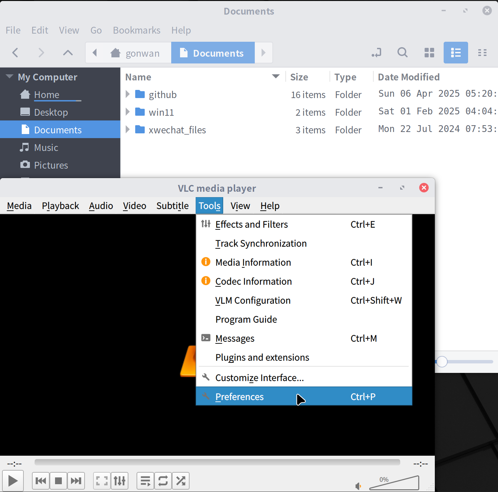
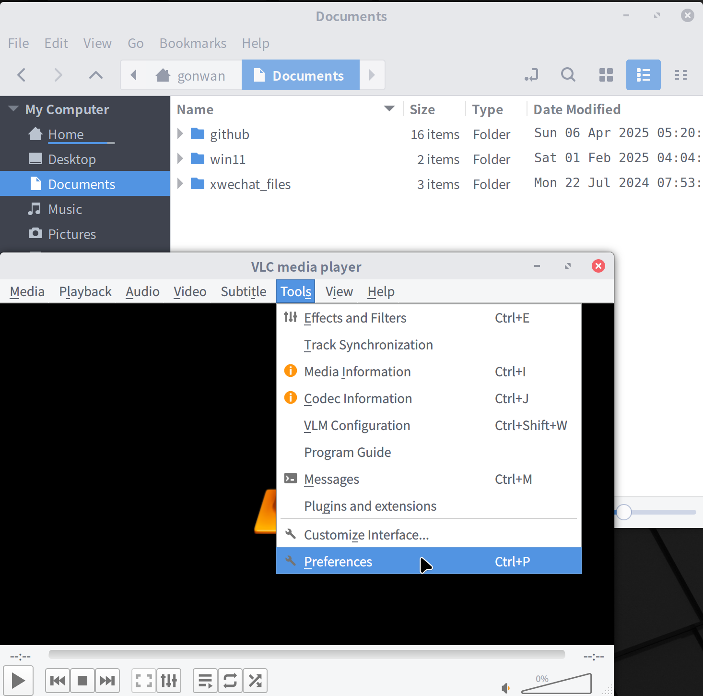

See: [https://wiki.archlinux.org/title/Uniform_look_for_Qt_and_GTK_applications](https://wiki.archlinux.org/title/Uniform_look_for_Qt_and_GTK_applications)

> **Theme**: The custom appearance of an application, widget set, etc. It usually consists of a style, an icon theme and a color theme. **Style**: The graphical layout and look of the widget set. **Icon Theme**: A set of global icons. **Color Theme**: A set of global colors that are used in conjunction with the style.

Actually a theme also controls fonts, and native dialogs, like open file dialog. How to write a Qt style is covered [here](https://www.olivierclero.com/code/custom-qstyle/).

I'm running Linuxmint 22 with Arc theme on my desktop. Fusion theme is used by default for Qt applications. They removed `qt5ct` in Linuxmint 22 in a fresh install. But it seems to be the best solution so far. Following is a comparison among the possible approaches, when run a Qt application. Which means launch a Qt application by:

```bash
$ QT_DEBUG_PLUGINS=1 QT_AUTO_SCREEN_SCALE_FACTOR=1 QT_QPA_PLATFORMTHEME=?? QT_STYLE_OVERRIDE=?? <app>
$ QT_DEBUG_PLUGINS=1 QT_AUTO_SCREEN_SCALE_FACTOR=1 QT_QPA_PLATFORMTHEME=qt5ct QT_STYLE_OVERRIDE= vlc
```

|   | has theme? | has style? | QT_QPA<br/>_PLATFORMTHEME | QT_STYLE<br/>_OVERRIDE | Description |
| --- | --- | --- | --- | --- | --- |
| Gtk2 | Yes | Yes | gtk2 | gtk2 or empty | Good for widgets, indicators in radio button and checkbox can be styled, follows current Gtk theme. But It has HiDPI issues, and certainly not maintained. |
| Gtk3 | Yes | No | gtk3 or empty | values in qt5ct | No style plugin. Fusion is used by default, which is not consistent with other themed Gtk applications. |
| qt5ct | Yes | Yes | qt5ct | values in qt5ct | A proxy style used, amost no difference to the default style. Fusion is used by default, which is not consistent with other themed Gtk applications. Color scheme and font can be further customized. Button indicators are not styled. |
| Kvantum | Yes | Yes | qt5ct | kvantum | Use Kvantum Manager to further customize the theme. Button indicators are styled. KvArc theme is provided, but is still somehow different in visual. Kvantum also installs several KDE component, which is odd. |

So my final solution is: using qt5ct with customized color scheme and font. Color scheme defined:

```ini
[ColorScheme]
active_colors=   #5c616c, #f5f6f7, #ffffff, #f3f3f3, #9f9d9a, #b8b5b2, #5c616c, #000000, #5c616c, #ffffff, #f5f6f7, #000000, #5294e2, #ffffff, #5294e2, #5c616c, #f3f3f3, #000000, #4b5162, #d3dae3, #805c616c
disabled_colors= #a9acb2, #fbfcfc, #ffffff, #f3f3f3, #9f9d9a, #b8b5b2, #a9acb2, #000000, #a9acb2, #f5f6f7, #fbfcfc, #000000, #5294e2, #ffffff, #5294e2, #a9acb2, #f3f3f3, #000000, #4b5162, #d3dae3, #80a9acb2
inactive_colors= #5c616c, #f5f6f7, #ffffff, #f3f3f3, #9f9d9a, #b8b5b2, #5c616c, #000000, #5c616c, #ffffff, #f5f6f7, #000000, #5294e2, #ffffff, #5294e2, #5c616c, #f3f3f3, #000000, #4b5162, #d3dae3, #805c616c
```

```ini
[ColorScheme]
active_colors=   #d3dae3, #383c4a, #979797, #5e5c5b, #302f2e, #4a4947, #d3dae3, #ffffff, #d3dae3, #404552, #383c4a, #000000, #5294e2, #ffffff, #5294e2, #d3dae3, #3e4350, #000000, #4b5162, #d3dae3, #80d3dae3
disabled_colors= #7c818c, #3e4350, #979797, #5e5c5b, #302f2e, #4a4947, #7c818c, #ffffff, #7c818c, #383c4a, #3e4350, #000000, #5294e2, #ffffff, #5294e2, #7c818c, #3e4350, #000000, #4b5162, #d3dae3, #807c818c
inactive_colors= #d3dae3, #383c4a, #979797, #5e5c5b, #302f2e, #4a4947, #d3dae3, #ffffff, #d3dae3, #404552, #383c4a, #000000, #5294e2, #ffffff, #5294e2, #d3dae3, #3e4350, #000000, #4b5162, #d3dae3, #80d3dae3
```

Copy those 2 file into `~/.config/qt5ct/color`, open `qt5ct`:

- Go to Appearance --> Platte --> Check custom and select arc.
- Go to Fonts --> Select your Gnome/Cinnamon font.
- Go to Icon Theme --> Select your Gnome/Cinnamon icon theme.
- Open `~/.config/qt5ct/qt5ct.conf`, change `standard_dialogs=default` to `standard_dialogs=gtk3`.

See the difference:  

**Updated May 4, 2025**, there is a refined `arc-theme` called [Qogir](https://github.com/vinceliuice/Qogir-theme), which provides Qt & KDE themes as well. The [Qt theme](https://github.com/pijulius/qogir-adwaita-qt) is based on [awaita-qt](https://github.com/FedoraQt/adwaita-qt).
