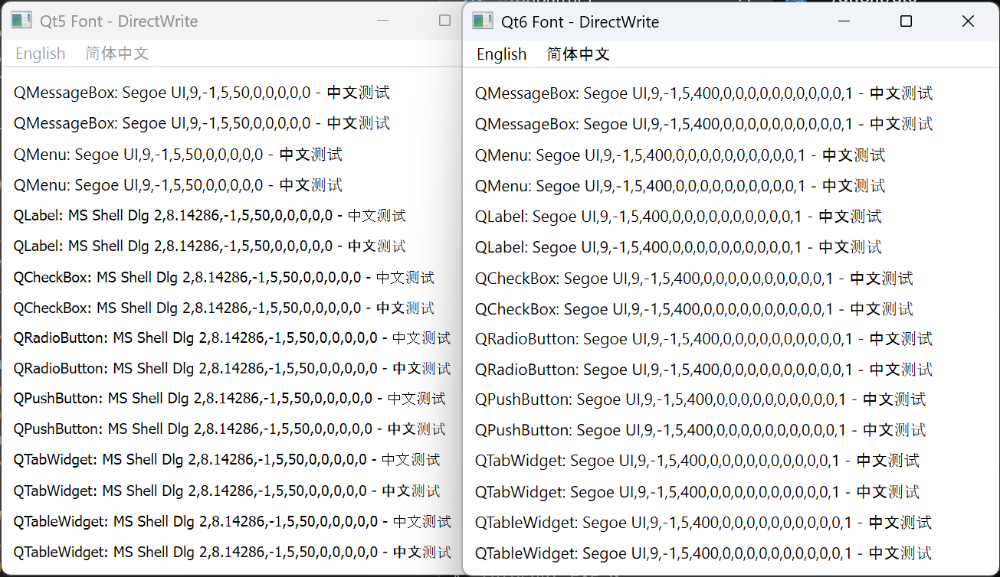
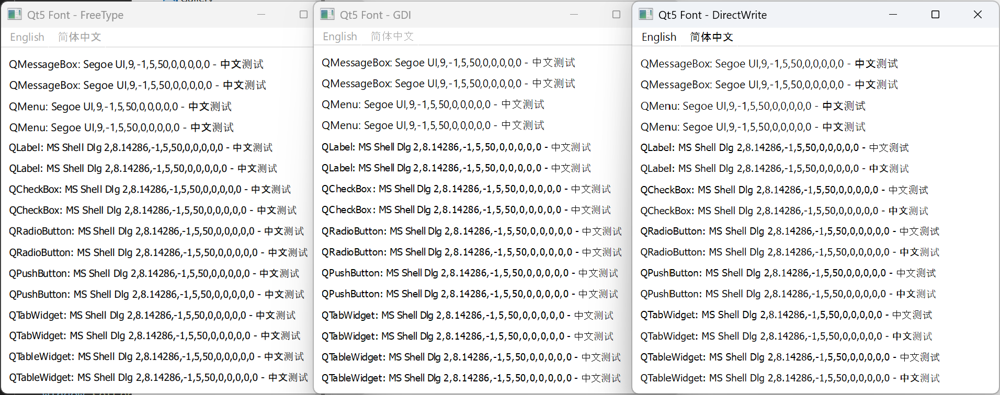
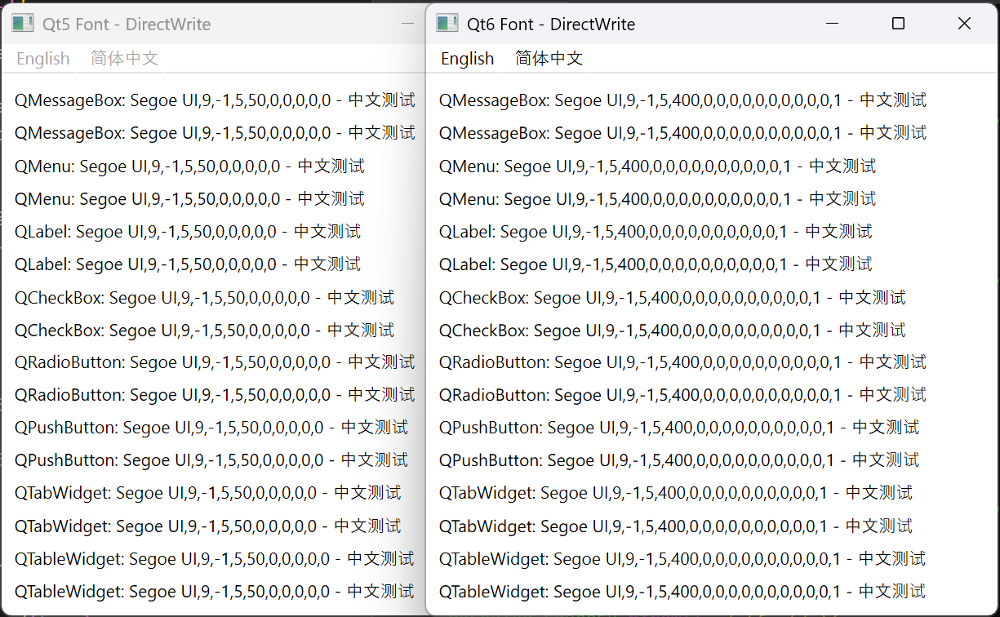
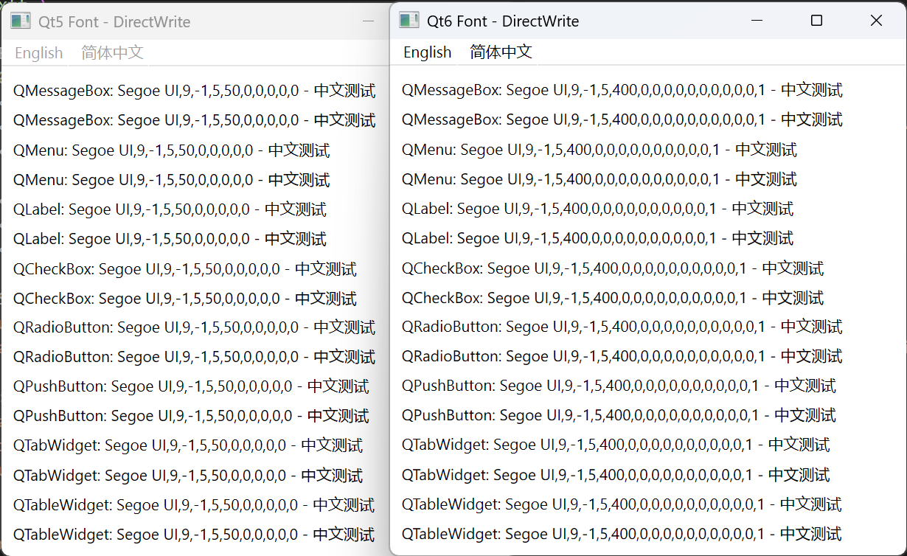
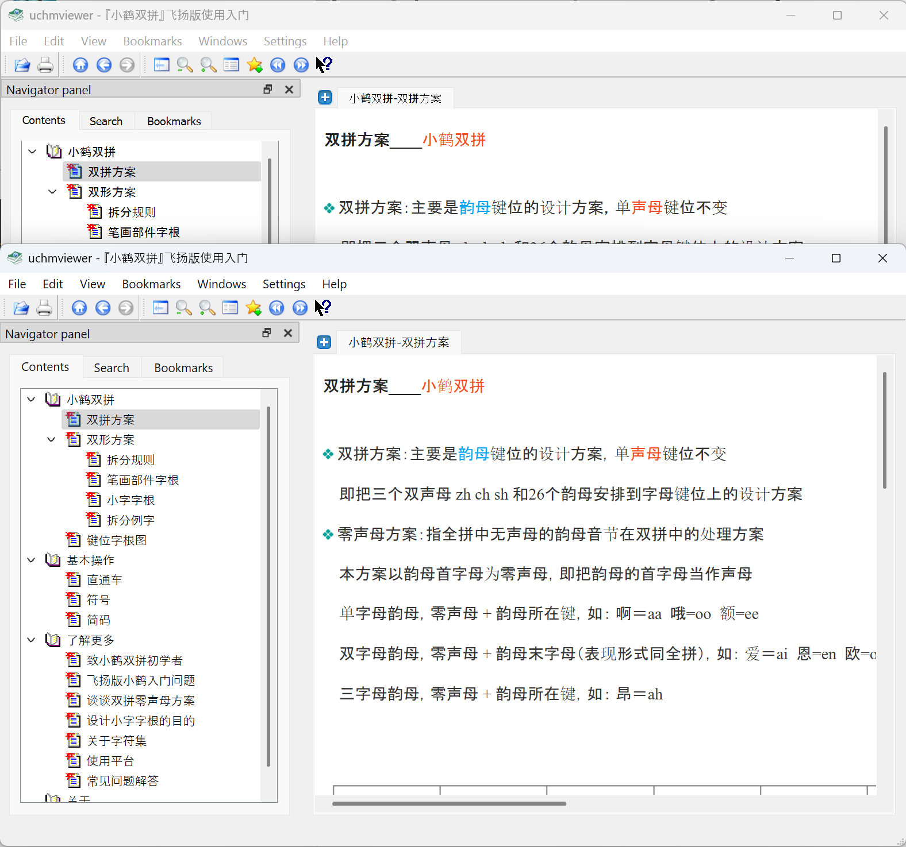
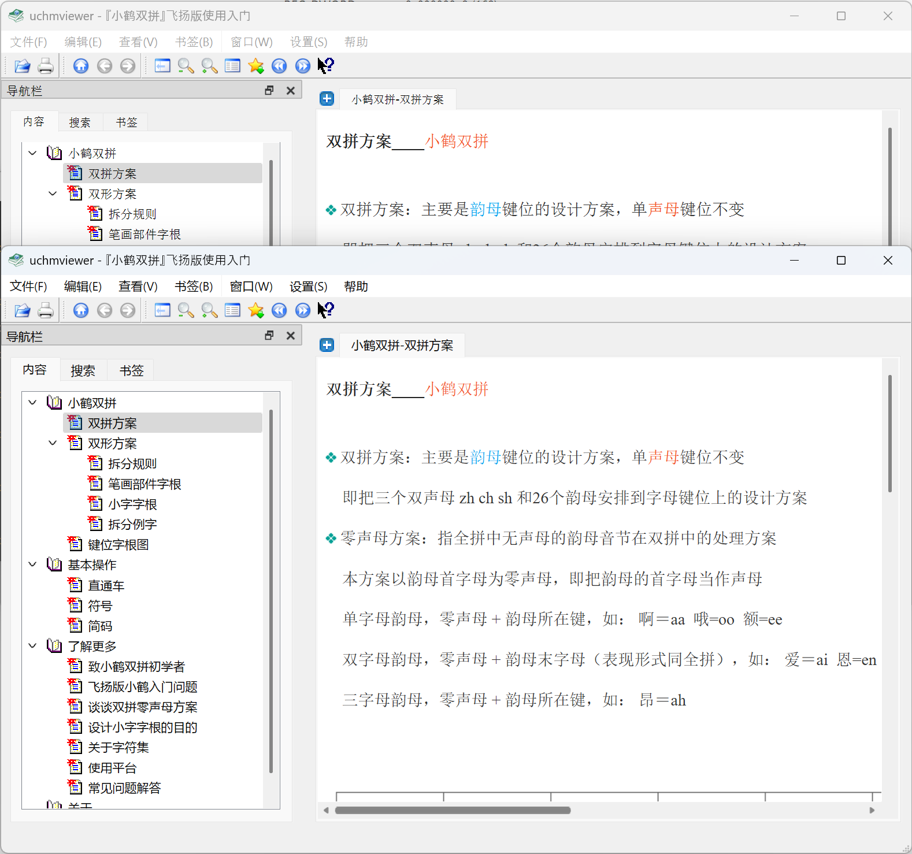
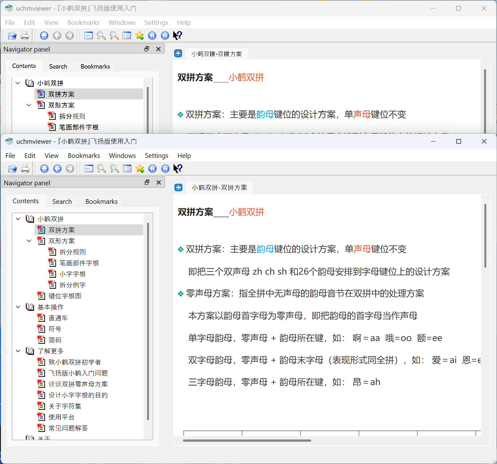
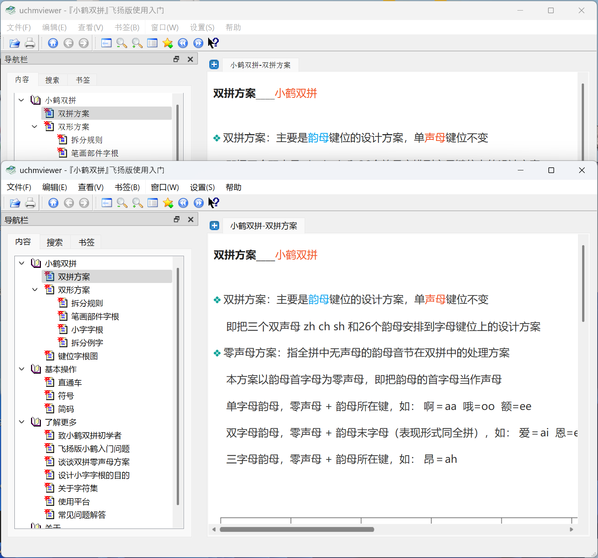

### 1. Font Selection in Qt

In Qt6, default font selection has changed, see [QTBUG-58610](https://bugreports.qt.io/browse/QTBUG-58610). In Qt5, it used legacy API `GetStockObject(DEFAULT_GUI_FONT)` to obtain the default GUI font, which returns `MS Shell Dlg 2, 8pt`. In Qt6, it switched to use `SystemParametersInfo(SPI_GETNONCLIENTMETRICS)`, which returns `Segoe UI, 9pt` using English user language, and `Microsoft YaHei UI, 9pt` using Chinese user language.

#### 1.1 Font Substitution

When a font is not found, a substitute one is used.

Regarding `MS Shell Dlg 2`,  Windows cannot find it in system. It looks into `HKEY_LOCAL_MACHINE\SOFTWARE\Microsoft\Windows NT\CurrentVersion\FontSubstitutes` register key, and found `MS Shell Dlg 2` is mapped to `Tahoma`. Referenced [here](https://learn.microsoft.com/en-us/globalization/fonts-layout/fonts#font-substitution).

Qt provides its own substitution API, `QFont::insertSubstitutions()`. But you do not need font substitution in most cases.

#### 1.2 Font Fallback

When a character is not contained in a font, a fallback one is used.

After finding `Tahoma`, Windows looks into `HKEY_LOCAL_MACHINE\SOFTWARE\Microsoft\Windows NT\CurrentVersion\FontLink\SystemLink` register key, to found its fallback fonts. Referenced [here](https://learn.microsoft.com/en-us/globalization/fonts-layout/fonts#font-linking-and-gdi). The fallback font list seems to be system language aware([GetSystemDefaultLangID()](https://learn.microsoft.com/en-us/windows/desktop/api/winnls/nf-winnls-getsystemdefaultlangid)), not user language aware([GetUserDefaultLangID()](https://learn.microsoft.com/en-us/windows/win32/api/winnls/nf-winnls-getuserdefaultlangid)). The language can be changed via `Control Panel` --> `Clock and Region` --> `Region` --> `Administrative` --> `Language for non-Unicode programs`.

When using English system language, the list for `Tahoma` gives:

```
MSGOTHIC.TTC,MS UI Gothic
MINGLIU.TTC,PMingLiU
SIMSUN.TTC,SimSun
GULIM.TTC,Gulim
YUGOTHM.TTC,Yu Gothic UI
MSJH.TTC,Microsoft JhengHei UI
MSYH.TTC,Microsoft YaHei UI
MALGUN.TTF,Malgun Gothic
SEGUISYM.TTF,Segoe UI Symbol
```

When using Chinese system language, the list gives:

```
SIMSUN.TTC,SimSun
MINGLIU.TTC,PMingLiU
MSGOTHIC.TTC,MS UI Gothic
BATANG.TTC,Batang
MSYH.TTC,Microsoft YaHei UI
MSJH.TTC,Microsoft JhengHei UI
YUGOTHM.TTC,Yu Gothic UI
MALGUN.TTF,Malgun Gothic
SEGUISYM.TTF,Segoe UI Symbol
```

Now, you see `SimSun` or `宋体` in Chinese is selected in the first position.

The register approaches seem only apply to `GDI` rendering, since `DirectWrite` has its own API.

#### 1.3 Font Fallback in Qt

Qt also has its own fallback function. You can pass in multiple font family names in `QFont`'s constructor. It one name is provided, Qt creates a `QFontEngine` for it, for rendering. It multiple names are provided, Qt creates a `QFontEngineMulti`, which is a composite with `QFontEngine`s for each font family. Qt also maintains an language-specific fallback list, see [qwindowsfontdatabase.cpp](https://github.com/qt/qtbase/blob/6.9/src/gui/text/windows/qwindowsfontdatabasebase.cpp#L961):

```cpp
static const char *other_tryFonts[] = {
    "Arial",
    "MS UI Gothic",
    "Gulim",
    "SimSun",
    "PMingLiU",
    "Arial Unicode MS",
    0
};

static const char *ch_CN_tryFonts [] = {
    "SimSun",
    "Arial",
    "PMingLiU",
    "Gulim",
    "MS UI Gothic",
    "Arial Unicode MS",
    0
};
```

If all Qt fallback fonts fail to render a character, Windows font fallback mechanism is used as last resort.

Font substitution and fallback in Qt work share the same functionality. They are constructed into a unified font list. see [here](https://github.com/qt/qtbase/blob/6.9/src/gui/text/qfontdatabase.cpp#L513):

```cpp
static QStringList familyList(const QFontDef &req)
{
    // list of families to try
    QStringList family_list;
 
    family_list << req.families;
    // append the substitute list for each family in family_list
    for (int i = 0, size = family_list.size(); i < size; ++i)
        family_list += QFont::substitutes(family_list.at(i));

    return family_list;
}
```

### 2. Font Rendering in Qt

Windows has three font engines for rendering: `DirectWrite`, `GDI` and `FreeType`. `DirectWrite` is the default one. `GDI` is the legacy one. `FreeType` is the cross-platform one. Font engine can be specified using [command line options](https://doc.qt.io/archives/qt-5.15/qguiapplication.html). 
```
$ <qtapp>.exe -platform windows:fontengine=freetype  # qt5, qt6
```


Qt switched to `DirectWrite` by default in Qt 6.8, so the command line options vary a bit. From Qt documents, you can always use `-platform windows:fontengine=freetype` to select `Freetype` in Qt5/Qt6. `GDI` and `FreeType` selection follows the table below. **BUT**, the document is **incorrect**! From my testing, `-platform windows:nodirectwrite` should still be used to select `GDI` in Qt >= 6.8. I do not have a Qt < 6.8 environment, so I am not sure about these versions.

|           | GDI                                                          | DirectWrite                                |
| --------- | ------------------------------------------------------------ | ------------------------------------------ |
| Qt5       | `-platform windows:nodirectwrite`                            | *default*                                  |
| Qt < 6.8  | *default*                                                    | `-platform windows:fontengine=directwrite` |
| Qt >= 6.8 | ~~`-platform windows:fontengine=gdi`~~<br />`-platform windows:nodirectwrite` | *default*                                  |

### 3. Font Changes from Qt5 to Qt6

Qt6 enables HiDPI by default, and set `Qt::HighDpiScaleFactorRoundingPolicy::PassThrough` to provide better support for fractional scaling. see [here](https://doc.qt.io/qt-6/portingguide.html#high-dpi).

As mentioned, Qt5 changes the default system font, as shown. Qt5 still uses `MS Shell Dlg 2`.



`Freetype`/`GDI`/`DirectWrite` comparison. `FreeType` is a bit bolder. `GDI` has poor anti-alias.



Qt5 vs Qt6 again, with fallback fonts and Qt5 replacing default font to `Segoe UI`. The even lines are rendering with font hinting disabled, for comparison. They look almost the same. But Qt5 is a bit more smooth, in my opinion. 



The screenshot was taken under English user language, Chinese fonts fallback to `Arial`. While Qt6 does render better under Chinese user language. Chinese fonts fallback to `Microsoft YaHei UI` in this case. You can also find that, disabling font hinting(` QFont::PreferNoHinting`) really makes it more smooth. As of Qt 6.9, features are actively being added to the `DirectWrite` engine, see [here](https://github.com/qt/qtbase/commits/dev/src/gui/text/windows/qwindowsfontenginedirectwrite.cpp). I am not able to find which commit made the difference, seems to be [this one](https://github.com/qt/qtbase/commit/407a98d94fb05780f30e77463fb2bd535041a044).



The simple font demo application, compiles for both Qt5 & Qt6:
```cpp
#include <QApplication>
#include <QLabel>
#include <QMainWindow>
#include <QMenuBar>
#include <QPalette>
#include <QVBoxLayout>
#ifdef _WIN32
#include <windows.h>
#endif

void fallbackFonts()
{
#ifdef _WIN32
    QFont systemFont = QApplication::font("QMessageBox");
    LANGID lid = GetUserDefaultLangID();
    QStringList result;
    result << systemFont.family();

    switch (lid & 0xff)
    {
    case LANG_CHINESE:
        if (lid == 0x0804 || lid == 0x1004)  // China mainland and Singapore
            result << "Microsoft YaHei UI" << "Microsoft YaHei" << "Arial"
                   << "Microsoft JhengHei UI" << "Microsoft JhengHei" << "Malgun Gothic" << "Yu Gothic UI" << "Meiryo UI"
                   << "Yu Gothic" << "Meiryo";
        else
            result << "Microsoft JhengHei UI" << "Microsoft JhengHei" << "Arial"
                   << "Microsoft YaHei UI" << "Microsoft YaHei" << "Malgun Gothic" << "Yu Gothic UI" << "Meiryo UI"
                   << "Yu Gothic" << "Meiryo";
        break;
    case LANG_JAPANESE:
        result << "Yu Gothic UI" << "Meiryo UI" << "Yu Gothic" << "Meiryo" << "Arial"
               << "Malgun Gothic" << "Microsoft YaHei UI" << "Microsoft YaHei" << "Microsoft JhengHei UI" << "Microsoft JhengHei";
        break;
    case LANG_KOREAN:
        result << "Malgun Gothic" << "Arial"
               << "Microsoft JhengHei UI" << "Microsoft JhengHei" << "Microsoft YaHei UI" << "Microsoft YaHei"
               << "Yu Gothic UI" << "Meiryo UI" << "Yu Gothic" << "Meiryo";
        break;
    default:
        result << "Arial" << "Yu Gothic UI" << "Meiryo UI" << "Yu Gothic" << "Meiryo" << "Malgun Gothic"
               << "Microsoft JhengHei UI" << "Microsoft JhengHei" << "Microsoft YaHei UI" << "Microsoft YaHei";
        break;
    }
    result << "Nirmala UI"
           << "Iskoola Pota"
           << "Ebrima"
           << "Arial Unicode MS"
           << "Segoe UI Emoji"
           << "Segoe UI Symbol";
    systemFont.setFamilies(result);
    QApplication::setFont(systemFont);
#endif
}

QString parseFontEngine(int argc, char *argv[])
{
    bool noDirectWrite = false;
    QString result;
    for (int i = 0; i < argc; ++i) {
        if (strcmp(argv[i], "-platform") == 0 && i + 1 < argc) {
            if (strncmp(argv[i+1], "windows:fontengine=", 19) == 0) {
                result = (argv[i+1] + 19);
            }
            if (strncmp(argv[i+1], "windows:nodirectwrite", 21) == 0) {
                noDirectWrite = true;
            }
        }
    }
    if (result == "freetype") {
        return "FreeType";
    } else {
#if QT_VERSION < QT_VERSION_CHECK(6, 0, 0)
        // https://github.com/qt/qtbase/blob/5.15/src/plugins/platforms/windows/qwindowsintegration.cpp
        return noDirectWrite ? "GDI" : "DirectWrite";
#elif QT_VERSION <= QT_VERSION_CHECK(6, 7, 0)
        // https://github.com/qt/qtbase/blob/6.7/src/plugins/platforms/windows/qwindowsintegration.cpp
        return (result == "directwrite") ? "DirectWrite" : "GDI";
#else
        // https://github.com/qt/qtbase/blob/6.9/src/plugins/platforms/windows/qwindowsintegration.cpp
        return (result != "gdi" && !noDirectWrite) ? "DirectWrite" : "GDI";
#endif
    }
}

int main(int argc, char *argv[])
{
    QString fontEngine = parseFontEngine(argc, argv);
#if QT_VERSION < QT_VERSION_CHECK(6, 0, 0)
	QCoreApplication::setAttribute(Qt::AA_EnableHighDpiScaling);
	QCoreApplication::setAttribute(Qt::AA_UseHighDpiPixmaps);
#if QT_VERSION >= QT_VERSION_CHECK(5, 14, 0)
	QGuiApplication::setHighDpiScaleFactorRoundingPolicy(Qt::HighDpiScaleFactorRoundingPolicy::PassThrough);
#endif
#endif

    QApplication app(argc, argv);
    QApplication::setStyle("Fusion");

    fallbackFonts();

    QMainWindow window;
#if QT_VERSION < QT_VERSION_CHECK(6, 0, 0)
    window.setWindowTitle("Qt5 Font - " + fontEngine);
#else
    window.setWindowTitle("Qt6 Font - " + fontEngine);
#endif
    window.resize(400, 400);
    QPalette pal;
    pal.setColor(QPalette::Window, Qt::white);
    window.setPalette(pal);
    window.setAutoFillBackground(true);
    /* menu */
    QMenuBar *menuBar = new QMenuBar(&window);
    QMenu *enMenu = menuBar->addMenu("English");
    enMenu->addAction("Open");
    enMenu->addAction("Close");
    QMenu *cnMenu = menuBar->addMenu("简体中文");
    window.setMenuBar(menuBar);
    /* fonts */
    QWidget widget(&window);
    window.setCentralWidget(&widget);
    QVBoxLayout layout;
    QStringList widgets;
    widgets << "QMessageBox" << "QMenu" << "QLabel"
        << "QCheckBox" << "QRadioButton" << "QPushButton" << "QTabWidget" << "QTableWidget";
    for (const QString &w: widgets) {
        QFont font = QApplication::font(w.toLocal8Bit().data());
        //font.setPointSize(12);
        QLabel *label = new QLabel(w + ": " + font.toString() + " - 中文测试");
        label->setFont(font);
        layout.addWidget(label);
        QLabel *label2 = new QLabel(w + ": " + font.toString() + " - 中文测试");
        font.setHintingPreference(QFont::PreferNoHinting);
        label2->setFont(font);
        layout.addWidget(label2);
    }
    widget.setLayout(&layout);
    window.show();
    return app.exec();
}
```

### 4. Some Implementation Details in Qt

#### 4.1 `QFontDatabase` 

The `QFontDatabase` class provides information about the fonts available in the underlying window system. It finally invokes into one of a specific platform-dependent instance. The inheritance:

```
QPlatformFontDatabase
+- QWindowsFontDatabaseBase
|  +- QWindowsFontDatabase (Windows/GDI)
|     +- QWindowsDirectWriteFontDatabase (Windows/DirectWrite, new class in Qt6)
+- QFreeTypeFontDatabase (Linux/Freetype)
   +- QWindowsFontDatabaseFT (Windows/FreeType)
   +- QFontconfigDatabase (Linux/FontConfig)
```

#### 4.2 `QFontEngine`

This is the rendering engine. The inheritance:

```
QFontEngine
+- QWindowsFontEngine
+- QWindowsFontEngineDirectWrite
+- QFontEngineFT
```

The invoking chain to the `DirectWrite` engine, when calling `QPainter::drawText()`:

```
QPainter::drawText()
--> QPainter::drawTextItem()
    --> QPainterPrivate::drawTextItem()
        --> QPaintEngine::drawTextItem()
            --> QWindowsFontEngineDirectWrite::bitmapForGlyph()
```
The invoking chain when showing a text `QLabel`:
```
QLabel::paintEvent()
--> QStyle::drawItemText()
    --> QPainter::drawText()
        --> /* same as above */
```

#### 4.3 Default Fonts

It comes from `QWindowsTheme`:

```cpp
void QWindowsTheme::refreshFonts()
{
    /* ... */
    m_fonts[SystemFont] = new QFont(QWindowsFontDatabase::systemDefaultFont());
    m_fonts[MenuFont] = new QFont(menuFont);
    m_fonts[MenuBarFont] = new QFont(menuFont);
    m_fonts[MessageBoxFont] = new QFont(messageBoxFont);
    /* ... */
    m_fonts[FixedFont] = new QFont(fixedFont);
}
```

### 5. Font Settings in 3rd-party Applications

- [vlc](https://code.videolan.org/videolan/vlc): Uses Qt5/`FreeType` in 3.0 versions, and [switched](https://code.videolan.org/videolan/vlc/-/merge_requests/4783) to Qt6/`DirectWrite` in 4.0.
- [telegram](https://github.com/telegramdesktop/tdesktop): Qt6 based. [Patches](https://github.com/desktop-app/patches/blob/master/qtbase_5.15.17/0003-fix-windows-font-fallback.patch) Qt font fallback list.
- [qbittorrent](https://github.com/qbittorrent/qBittorrent): Qt6 based. `Microsoft YaHei UI` is automatically chosen under Chinese user language, and renders great. Also [suggested](https://github.com/qbittorrent/qBittorrent/issues/13853) to use `FreeType` if there is blurry text.
- [smplayer](https://github.com/smplayer-dev/smplayer): Qt5 based. No specific font tweak, all Qt command line switches work.
- [obs](https://github.com/obsproject/obs-studio): Qt6 based. Uses customized fonts and qss.
- [free download manager](https://www.freedownloadmanager.org/): Qt6 based, close-sourced. The font seems to be hardcoded to `SimSum` even if Chinese user language is set.

### 6. Conclusion

If Qt5 is used, set default font to `Segoe UI` as shown in my demo code. Add font fallback list.

If Qt6 is used, Adding font fallback list is enough.

In both cases, disable font hinting for a more smooth rendering. In Qt5, switching to `FreeType` also works. Here are some comparison with patched [uchmviewer](https://github.com/eBookProjects/uChmViewer), in Qt5.

- English user language, English system language:



- Chinese user language, English system language:



- English user language, Chinese system language:



- Chinese user language, Chinese system language:

