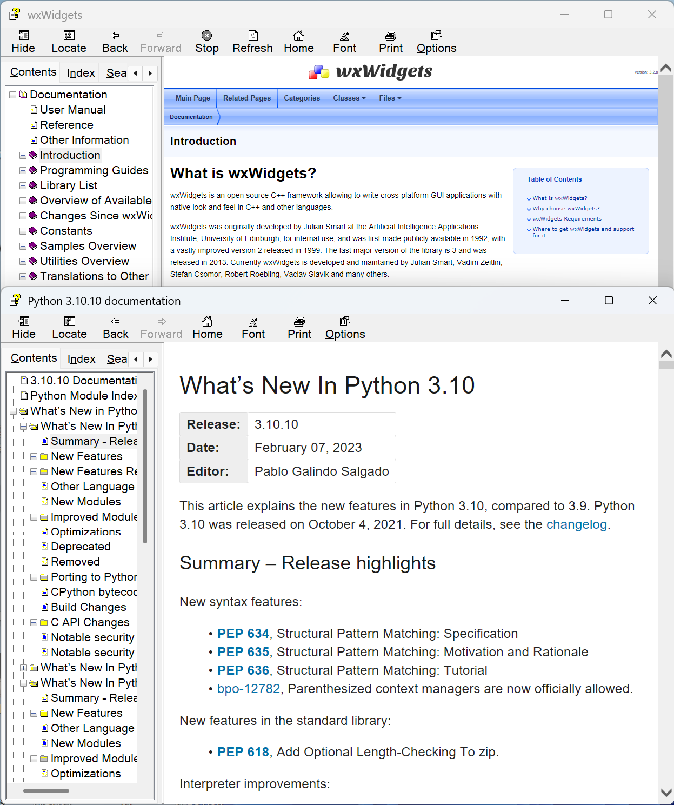
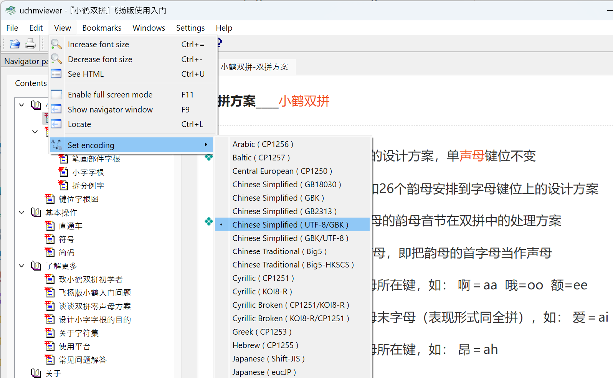

Although CHM is through as a legacy format for documents, still a few documents are using it, including `wxWdigets` and `Python`(up to 3.10). [uchmviewer](https://github.com/eBookProjects/uChmViewer)([kchmviewer](https://github.com/gyunaev/kchmviewer)) is a cross-platform CHM viewer. It seems to be the only one that works under Linux. [xchm](https://github.com/rzvncj/xCHM) has poor support for CJK languages. [okular](https://github.com/KDE/okular) has performance issues when viewing CHM, and they removed support in recent versions. [SumatraPDF](https://github.com/sumatrapdfreader/sumatrapdf) is also an alternative under Windows.

### 1. Encodings

Under Windows, `hh.exe` is the default CHM viewer. It is a MBCS application, say, it only handles the current system language/encoding you are using. If the file name contains Chinese and you are under English language/encoding, the file will not open. If links containing Chinese characters are used inside the file, it also fails to display. The only solution is to set the system language to Chinese, via `Control Panel` --> `Clock and Region` --> `Region` --> `Administrative` --> `Language for non-Unicode programs`.

It is inconvenient, if you are not a Chinese user at all. `uchmviewer` solves the problem by allowing you to manual select the encodings used in a CHM file. But there still other issues. Some malformed CHM files use two different encodings. One for CHM internal use, and another for HTML page. The *internal encoding* is described above, it is used to maintain meta data about the CHM file, including title, links, index. The *page encoding* is used to display an HTML page.

When parsing a CHM file, several different encodings are used. When **decoding** the URLs of pages, the *internal encoding*(an MBCS encoding, for instance `GBK`) is used to decode strings in `#STRINGS` and `#URLSTR` sections. A `#STRINGS` entry gives the name of a page(the one listed in TOC). A `$URLSTR` entry gives the URL of a page. When actually **reading** the content of a page, a fixed `UTF-8` encoding is used to encode the URL back to retrieved the content. Finally, the *page encoding*(i.e., `<meta http-equiv="Content-Type" content="text/html; charset=GBK" />`) is used to display the HTML content.

In addition, page names in `#STRINGS` are directly extracted from `<title>` tags of HTML pages, when building(**writing**) a CHM file. Both *internal encoding* and *page encoding* are used here. If charset is `UTF-8`, the page name will be converted into *internal encoding*. If these two MBCS encoding match, no convertion. If these two MBCS encoding mismatch, a malformed CHM file is built.

That is all the mass with CJK encodings.

### 2. Font size

Another finding is the font size. The default font size in `Python` document is bigger than that in `wxWidgets` documents. The reason is: `Python` uses `em` as their font unit, which is HiDPI aware, while `wxWidgets` uses `px`.

### 3. Conclusion

`hh.exe` and [`HTML Help Workshop`](https://learn.microsoft.com/en-us/previous-versions/windows/desktop/htmlhelp/microsoft-html-help-downloads) are both MBCS applications. If your CHM file uses CJK languages, better build the file in that encoding. The system language **must** also be set to that encoding when building.

`uchmviewer` allows to manually select the internal and page encodings. 

If it still impossible to display some malformed CHM files, decompile the file, patch it, and recompile the file yourself. 

The latest chm spec can be found [here](https://www.nongnu.org/chmspec/latest/).
