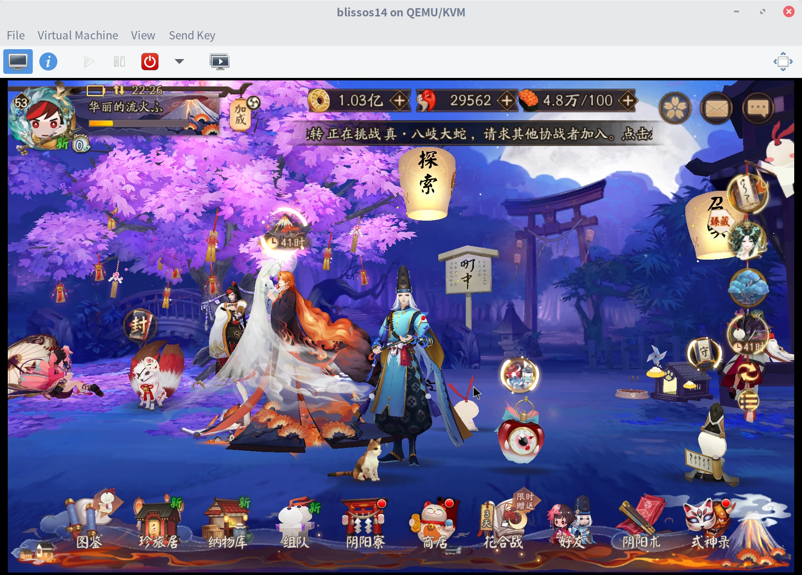

Should work under LinuxMint 21/22, Ubuntu 22.04/24.04.

### 1. Install `qemu` and `virt-manager`
```bash
$ sudo apt-get install qemu-system-x86 virt-manager
$ sudo usermod -G libvirt -a ${USER}
```
Reboot.

### 2. Install BlissOS using `virt-manager`

BlissOS 14 or 15 is recommended, they provide better compatabilities for Arm/Arm64 ABI. I choose BlissOS 14, `Bliss-v14.10.2-x86_64-OFFICIAL-opengapps-20240603.iso`.

Create a new virtual machine, and select `Local install media`. In next step, choose `BlissOS` iso file, and manual select `Android-x86 9.0` as profile. In next steps, config CPU/memory/storage settings. At last step, check `Customize configuration before install`.

In `Overview` tab, set chipset to `Q35`, set firmware to `BIOS`.

In `Video QXL` tab, set model to `Virtio` and check `3D acceleration` In `Display Spice`, set listen type to `None` and check `OpenGL`. These 2 configuration enables `VirGL` support in `QEMU`.

Now start to install `BlissOS`, choose `dos` partition and mark it as bootable when asked.

### 3. BlissOS Configuration

BlissOS comes with `Termux`, install ssh/scp for file sharing between host. Root access may be granted via `KernelSU`.
```
$ pkg install sudo
$ pkg install openssh openssl
$ scp <user>@<host>:/home/<user>/some_app.apk /storage/emulated/0
```

Now edit grub config file:
```bash
$ blkid
...
/dev/block/vda1: LABLE="BlissOS" ...
...
```
I got `/dev/block/vda1` as root partition, Mount it as RW:
```bash
$ mkdir /mnt/boot
$ mount /dev/block/vda1 /mnt/boot
$ vi /mnt/boot/boot/grub/android.cfg
```

Add boot parameter to `QEMU/KVM - Virgl` entity:
```
video=1920x1200 CODEC2_LEVEL=0 OMX_NO_YUV420=1
```
- `video=1920x1200`: set screen resolution
- `CODEC2_LEVEL=0 OMX_NO_YUV420=1`: fix an ffmpeg decode issue.

### 4. Known Issues

I am a `阴阳师`(Chinese version of [Onmyoji](https://play.google.com/store/apps/details?id=com.netease.onmyoji.gb&hl=en_US)) player. The game should now launch.


But there are several issues:

- Only Android accounts are supported. The installation `*.apk` is downloaded from [official store](https://mumu.163.com/games/) of `MumuPlayer`. It is in native `x86_64` ABI, and does support iOS account when running in `MumuPlayer`. Seems `Netease` has added some environment checks.

- Maps do not load, including demon encounter maps and area boss maps. From log, it reads:
```
JNIManager Failed to call method create with signiture (I)Lcom/netease/neox/NXMapViewContainer;!
```
Do not know how to solve this. I believe it used to work before Sep, 2024.

**Updated Jul 29, 2025**: [`Bluestacks`](https://www.bluestacks.com/) in bare-metal and virtual machine environment are both known to load maps, other than `MumuPlayer`. The normal version(`arm64` ABI) should be used. The `x86_64` ABI version also does not work.

 

- `BlissOS` 14.10.3 is broken. The game fails to connect to its server. They disabled `VirtWifi` in 14.10.3 build. Add `VIRT_WIFI=1` to kernel parameter to rollback the behavior. Another one is caused by `KernelSU` update, See [here](https://github.com/tiann/KernelSU/issues/2113). Add `syscall_hardening=off` to kernel parameter to workaround it.

### 5. Vulkan Support

`QEMU` with Vulkan support comes in 9.2 release, see [here](https://gist.github.com/peppergrayxyz/fdc9042760273d137dddd3e97034385f) for more details. I built both 9.2.4 and 10.0.3 from source, and the later one gived more smooth experience.

I was able to enable Vulkan with a Ubuntu 25.04 guest, but failed with `BlissOS` 14, with and without `ANGLE=1` kernel parameter.

To run new versions of `QEMU` in `virt-manager`, some `AppArmor` permission should be fixed.

```bash
$ sudo vi /etc/apparmor.d/usr.sbin.libvirtd
$ sudo vi /etc/apparmor.d/abstractions/libvirt-qemu
```
Add path of new binary to these 2 files, and restart `apparmor` service.

```bash
$ sudo vi /etc/libvirt/qemu.conf
...
security_driver = []
security_default_confined = 0
seccomp_sandbox = 0
namespaces = []
...
```
Disable security completely and restart `libvirtd` service.

### 6. Conclusion

With all the issues listed above. I think it is better to use `MumuPlayer` for Android emulation, especially games from Mainland China. They just add obstacles for unofficial or unknown emulator environments. Combination of `QEMU` and `BlissOS` cannot always bypass these limitations.

If a game provides a Windows client, running with `wine` or `steam/proton` is also an alternative.
