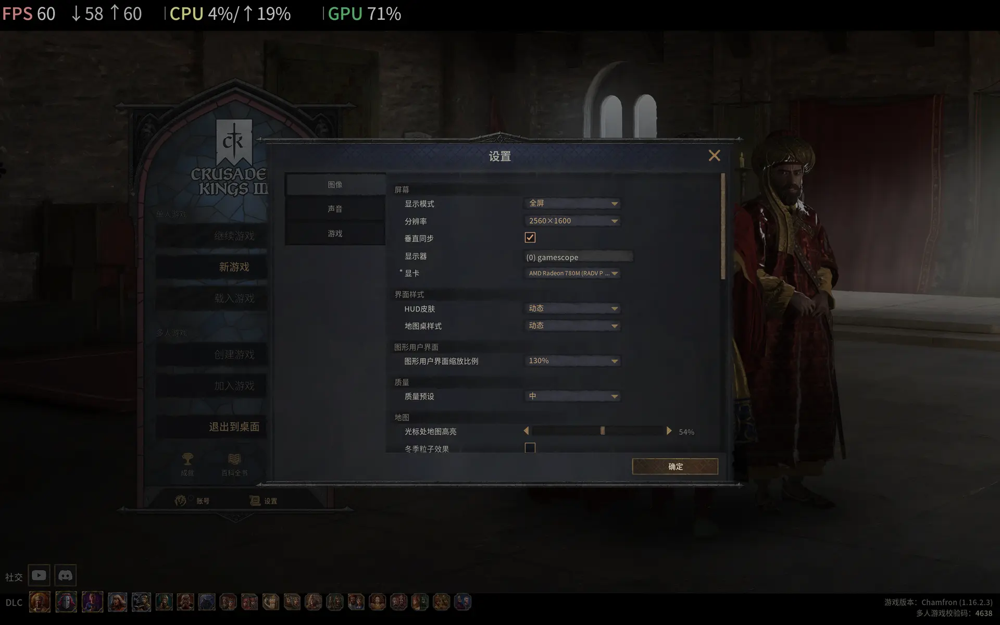
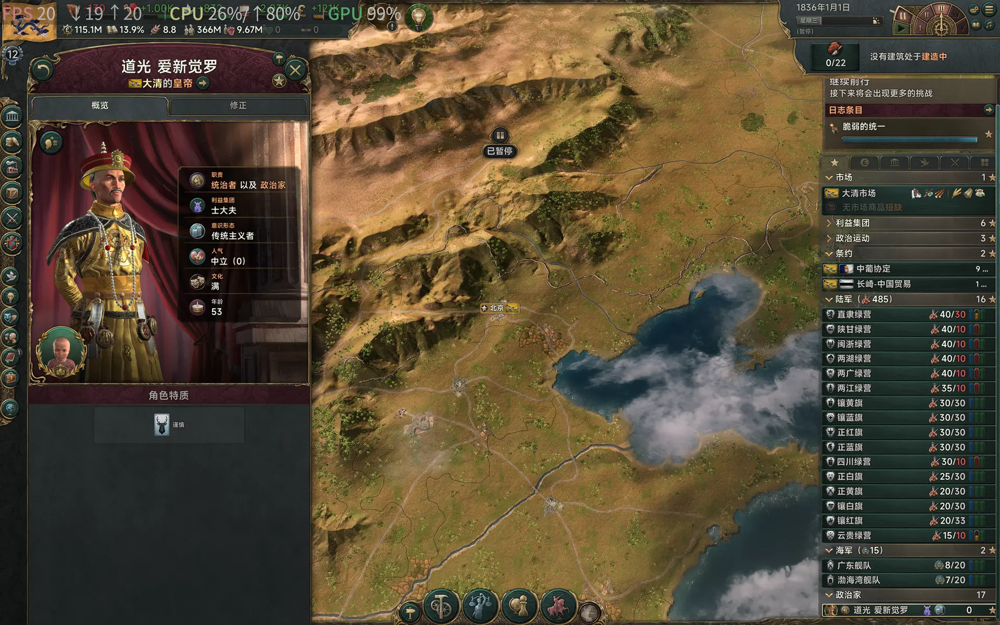
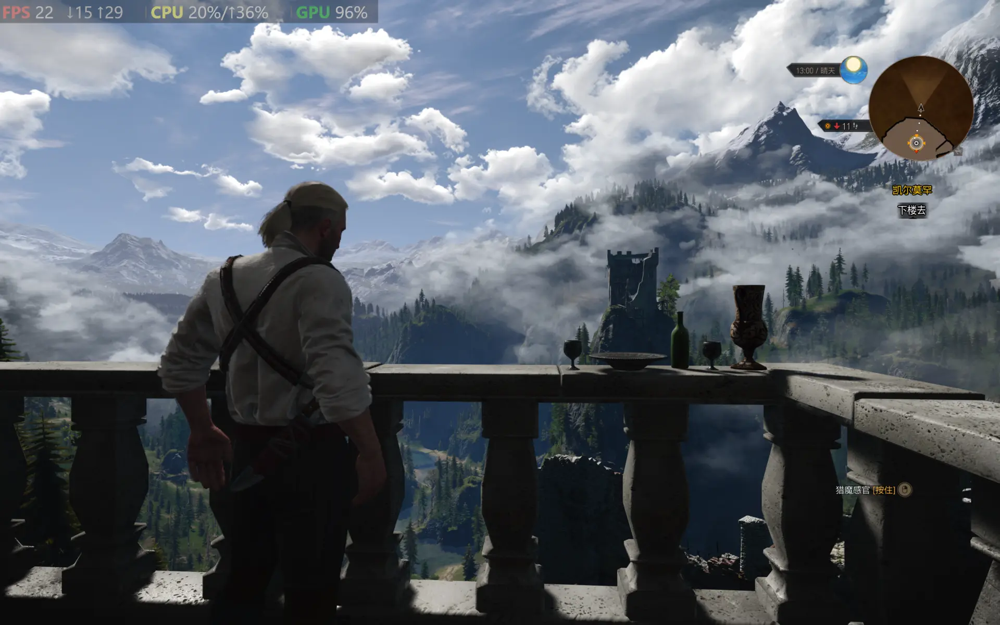

Just read [ROG Xbox Ally runs better on Linux than the Windows it ships with](https://www.tomshardware.com/video-games/handheld-gaming/rog-xbox-ally-runs-better-on-linux-than-the-windows-it-ships-with-new-test-shows-up-to-32-percent-higher-fps-with-more-stable-framerates-and-quicker-sleep-resume-times). I will share my experience and compare gaming performance under Windows and Linux, with 5 games on my Lenovo Ideapad/Xiaoxin laptop.

### 1. Environment
- Hardware
  - CPU: AMD 7840HS (Zen4)
  - GPU: AMD 780M iGPU (RDNA3) with 8G vRAM setup in UEFI
  - Memory: 24G (32G total, 8G is assigned to iGPU in UEFI)
- Windows 11 25H2
  - AMD graphic driver 2025.9.1 (latest)
- Linux Mint 22.2
  - Kernel 6.14
  - Mesa 25.0.7
  - Proton 9.0-4
- Power plans are both set to `Power Saver`, which supplies about 24 Watt to the iGPU.
  - I do not like much noise. `Power Saver` mode does provide more stable gaming performance in my experience.
- All FPS values are raw frame values measured by Steam overlay, without FSR addition.
- Benchmarks are running 1080P or 2K in fullscreen, with same graphic settings on both platforms. Most games gives better performance in fullscreen under both Windows and Linux.
  - **NOTE**: `X11` has incomplete support for fractional scaling. It just scale up using an integer scale factor, then resize down to fit into the display. For my 2880x1800 monitor, 175% scaling actually renders at 3296x2060, while 150% scaling actually renders at 3840x2400. Thus, switch to 100% or 200% scaling for better performance.

### 2. Benchmark

#### 2.1 Crusader Kings III

[Crusader Kings III](https://store.steampowered.com/app/1158310/Crusader_Kings_III/) provides Vulkan on Windows and Linux. All benchmarks are running 2K, middle quality preset. A fixed version 1.16.2 is used.

- Windows Vulkan - 29 FPS

- Linux Vulkan - 40 FPS

- Graphic Settings

Linux gives much more FPS(~35%) than Windows.

#### 2.2 Victoria 3

[Victoria 3](https://store.steampowered.com/app/529340/Victoria_3/) provides DX11/Vulkan under Windows, and Vulkan under Linux. All benchmarks are running 2K, middle quality preset. A fixed version 1.9.8 is used.

**NOTE**: Make sure `Fullscreen` is selected under Linux. This make FPS increase from 15 to 20. Otherwise, even moving the mouse lags.

- Windows DX11 - 18 FPS

- Linux Vulkan - 20 FPS

- Linux Proton/Dx11 - 22 FPS

- Graphic Settings

Linux gives slightly more FPS(~10%) than Windows.
<!-- more -->

#### 2.3 Age of Wonders 4

[Age of Wonders 4](https://store.steampowered.com/app/1669000/Age_of_Wonders_4/) only provides DX12 under Windows. All benchmarks are running 1080P or 2K, middle quality preset. The in-game help page is chosen to measure, because it gives the most GPU stress. The adventure map generally runs at a higher FPS.

- Windows DX12 1080P - 21 FPS

- Linux Proton/DX12 1080P - 30 FPS

- Windows DX12 2K - 13 FPS

- Linux Proton/DX12 2K - 20 FPS

- Graphic Settings

Linux gives much more FPS(~45%) than Windows.

#### 2.4 Tomb Raider

[Tomb Raider 2013](https://store.steampowered.com/app/203160/Tomb_Raider/) provides DX11 under Windows, and OpenGL under Linux. Both versions are 32-bit. All benchmarks are running 2K, high quality preset.

- Windows DX11 - 33 FPS

- Linux OpenGL - 45 FPS

- Linux Proton/DX11 - 45 FPS

Linux gives much more FPS(~35%) than Windows.

#### 2.5 The Witcher 3

[The Witcher 3: Wild Hunt](https://store.steampowered.com/app/292030/) only provides DX11/DX12 under Windows. All benchmarks are running 2K, high quality preset.

- Windows DX11 - 20 FPS

- Linux Proton/DX11 - 25 FPS

- Windows DX12 - 22 FPS

- Linux Proton/DX12 - 26 FPS

- Graphic Settings

Linux gives much more FPS(~25%) than Windows.

### 3. Summary

|        Game        | Platform | Graphic API | Quality Preset | FPS  | Performance Gain |
| :----------------: | :------: | :---------: | :------------: | :--: | :--------------: |
| Crusader Kings III | Windows  |   Vulkan    |   2K middle    |  29  |                  |
|                    |  Linux   |   Vulkan    |   2K middle    |  40  |       38%        |
|     Victoria 3     | Windows  |    DX11     |   2K middle    |  18  |                  |
|                    |  Linux   |   Vulkan    |   2K middle    |  20  |       11%        |
|                    |  Linux   | Proton/DX11 |   2K middle    |  22  |       22%        |
|  Age of Wonders 4  | Windows  |    DX12     |  1080P middle  |  21  |                  |
|                    |  Linux   | Proton/DX12 |  1080P middle  |  30  |       43%        |
|                    | Windows  |    DX12     |   2K middle    |  13  |                  |
|                    |  Linux   | Proton/DX12 |   2K middle    |  20  |       54%        |
|    Tomb Raider     | Windows  |    DX11     |    2K high     |  33  |                  |
|                    |  Linux   |   OpenGL    |    2K high     |  45  |       36%        |
|                    |  Linux   | Proton/DX11 |    2K high     |  45  |       36%        |
|   The Witcher 3    | Windows  |    DX11     |    2K high     |  20  |                  |
|                    |  Linux   | Proton/DX11 |    2K high     |  25  |       25%        |
|                    | Windows  |    DX12     |    2K high     |  22  |                  |
|                    |  Linux   | Proton/DX12 |    2K high     |  26  |       18%        |

It's hard to tell which factor has the most influence on the gaming performance. Proton is becoming more and more mature, with almost no transplie penalty. All the 5 games give more FPS under Linux than Windows. Performance gains from 11% to 54%.

Two points to notice:

1. `Steam Deck` ships with AMD iGPU, much optimization may already be landed in kernel and graphic stacks.
2. Windows has more and more bloat these days. I am not sure whether a previous version like 24H2 or even Windows 10 will give a better performance. But the most important, Linux gives a more **stable** gaming experience. No popups, no sudden lags, no endless and useless updates. Everything is under your control.

I also benchmarked with `ntsync`-enabled Proton versions, almost no difference against the stock one.

Benchmarks may be machine-specific. If you have different gaming experience, comments are very welcome!