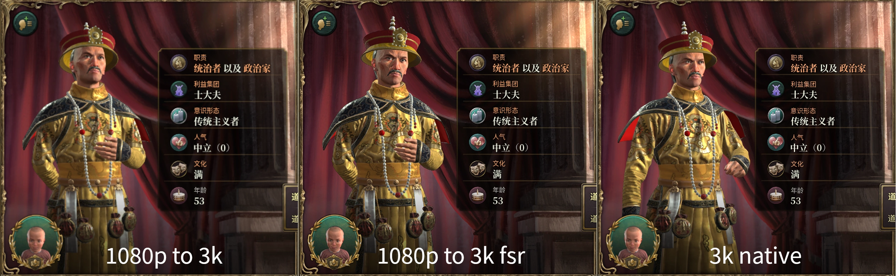

### 1. Environment
- Hardware
  - CPU: AMD 7840HS (Zen4)
  - GPU: AMD 780M iGPU (RDNA3) with 8G vRAM setup in UEFI
  - Memory: 24G (32G total, 8G is assigned to iGPU in UEFI)
- Windows 11 25H2
  - AMD graphic driver 2025.9.1 (latest)
- Power plans are both set to `Power Saver`, which supplies about 24 Watt to the iGPU.
  - I do not like much noise. `Power Saver` mode does provide more stable gaming performance in my experience.

### 2. Add Windows Defender Exclusion

Go to `Windows Security` app --> `Virus & threat protection` --> `Virus & threat protection settings` --> `Exclusions`. Add exclusion as **Process** type, say add `victoria3.exe` for `Victoria 3` and `ck3.exe` for `Crusader Kings III`. Since shader caches are not always located in the same folder, adding the process name simplify the exclusion operation.

#### 2.1 Victoria 3

`Paradox` updates their games in high frequency. Shaders are generated every time, which takes a lot of time. [Victoria 3](https://store.steampowered.com/app/529340/Victoria_3/) generates about 600MB+ shaders. A fixed version 1.9.8 is used to measure the start time.

|            | Exclusion? | Shader Cached? | Run1 | Run2 |
| :--------: | :--------: | :------------: | :--: | :--: |
| Cold start |     N      |       N        | 232s | 235s |
| Cold start |     Y      |       N        | 171s | 168s |
| Warm start |     N      |       N        | 186s | 183s |
| Warm start |     Y      |       N        | 165s | 165s |
| Warm start |     N      |       Y        | 15s  | 15s  |
| Warm start |     Y      |       Y        | 14s  | 14s  |

#### 2.2 Crusader Kings III

[Crusader Kings III](https://store.steampowered.com/app/1158310/Crusader_Kings_III/) generates about 120MB+ shaders. A fixed version 1.16.2 is used to measure the start time.

|            | Exclusion? | Shader Cached? | Run1 | Run2 |
| :--------: | :--------: | :------------: | :--: | :--: |
| Cold start |     N      |       N        | 150s | 144s |
| Cold start |     Y      |       N        | 54s  | 54s  |
| Warm start |     N      |       N        | 52s  | 51s  |
| Warm start |     Y      |       N        | 47s  | 46s  |
| Warm start |     N      |       Y        | 28s  | 28s  |
| Warm start |     Y      |       Y        | 26s  | 26s  |

In both games, the warm start time is reduced by ~10% after excluding them in Windows Defender. And the cold start time is largely reduced.

### 3. RSR

`RSR`(Radeon Super Resolution) upscaling can be used to improve the video quality for games that do not support `FSR`(FidelityFX Super Resolution). **NOTE**: If you take screenshots to compare `RSR` and `non-RSR` versions of image quality, they are the same. `RSR` is a in-driver feature, screenshot utilities do not read the optimized images.

Here's a comparison among different graphic settings, though these images are shot under Linux. The `RSR` version under Windows looks just like the middle one under Linux. The `RSR` version makes the text more readable, and increases sharpness to provide clearer graphics.

In addition, a clearer font also improves readability.

### 4. AFMF
`AFMF`(AMD Fluid Motion Frames) increases FPS by generating additional frames. It makes games to run more smooth in most cases. But it has performance penalty, the base FPS is slightly decreased. If the feature has negative effects in your game, you may want to disable it.

### 5. Temperature

It's autumn in China. My laptop is much cooler than in summer, thus gives better gaming experience.

