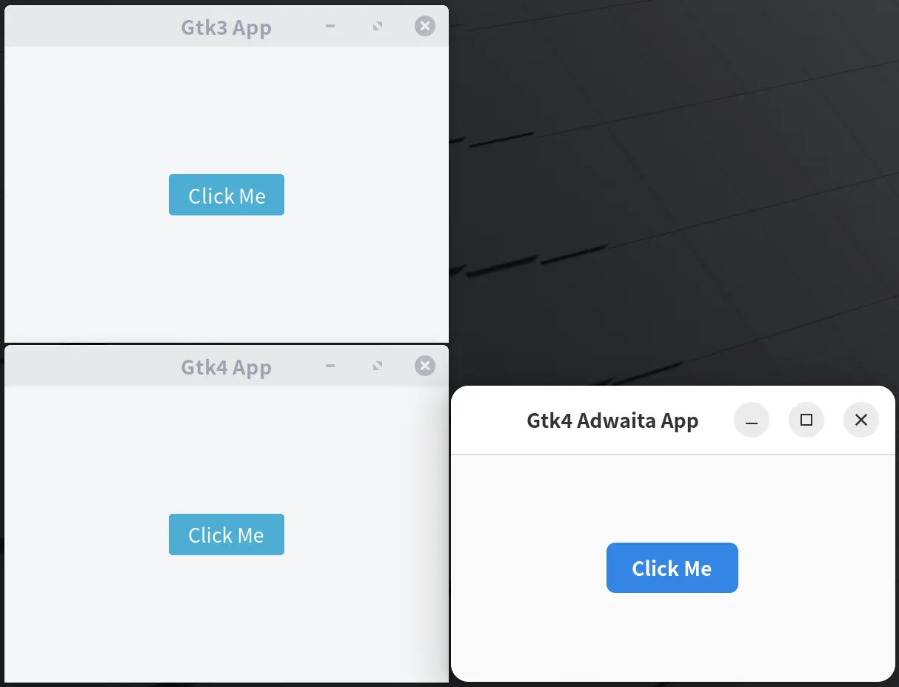

Also see my previous post: [Uniform look for Qt and GTK applications](https://www.gonwan.com/2025/04/13/uniform-look-for-qt-and-gtk-applications).

It is really frustrated to find that libadwaita applications are entirely not themed. Gtk guys are breaking things! again!!

Well, just want to dig more here. I'm running LinuxMint 22.3 / Ubuntu 24.04.

### 1. Default Looks

Write a simplest gtk3/gtk4 window with a button:

```c
// gcc gtk4.c -o gtk4 `pkg-config --cflags --libs gtk4`
// gcc gtk4.c -o gtk3 `pkg-config --cflags --libs gtk+-3.0`
#include <gtk/gtk.h>

static void on_button_clicked(GtkButton *button, gpointer user_data)
{
    g_print("Button Clicked!\n");
}

static void activate(GtkApplication *app, gpointer user_data)
{
    GtkWidget *window;
    GtkWidget *button;

    window = gtk_application_window_new(app);
#if GTK_MAJOR_VERSION >= 4
    gtk_window_set_title(GTK_WINDOW(window), "Gtk4 App");
#else
    gtk_window_set_title(GTK_WINDOW(window), "Gtk3 App");
#endif
    gtk_window_set_default_size(GTK_WINDOW(window), 300, 200);

    button = gtk_button_new_with_label("Click Me");
    gtk_widget_set_halign(button, GTK_ALIGN_CENTER);
    gtk_widget_set_valign(button, GTK_ALIGN_CENTER);
#if GTK_MAJOR_VERSION >= 4
    gtk_widget_add_css_class(button, "suggested-action");
#else
    gtk_style_context_add_class(gtk_widget_get_style_context(button), "suggested-action");
#endif
    g_signal_connect(button, "clicked", G_CALLBACK(on_button_clicked), NULL);

#if GTK_MAJOR_VERSION >= 4
    gtk_window_set_child(GTK_WINDOW(window), button);
    gtk_window_present(GTK_WINDOW(window));
#else
    gtk_container_add(GTK_CONTAINER(window), button);
    gtk_widget_show_all(window);
#endif
}

int main(int argc, char *argv[])
{
    GtkApplication *app;
    int status;

#if GTK_MAJOR_VERSION >= 4
    app = gtk_application_new("org.example.gtk4", G_APPLICATION_DEFAULT_FLAGS);
#else
    app = gtk_application_new("org.example.gtk3", G_APPLICATION_DEFAULT_FLAGS);
#endif
    g_signal_connect(app, "activate", G_CALLBACK(activate), NULL);
    status = g_application_run(G_APPLICATION(app), argc, argv);
    g_object_unref(app);
    return status;
}
```

A gtk4 one with libadwaita:

```c
// gcc gtk4adw.c -o gtk4adw `pkg-config --cflags --libs libadwaita-1`
#include <adwaita.h>

static void on_button_clicked(GtkButton *button, gpointer user_data)
{
    g_print("Button Clicked!\n");
}

static void activate(GtkApplication *app, gpointer user_data)
{
    GtkWidget *window;
    GtkWidget *main_box;
    GtkWidget *header_bar;
    GtkWidget *button;

    window = adw_application_window_new(app);
    gtk_window_set_title(GTK_WINDOW(window), "Gtk4 Adwaita App");
    gtk_window_set_default_size(GTK_WINDOW(window), 300, 200);

    main_box = gtk_box_new(GTK_ORIENTATION_VERTICAL, 0);
    adw_application_window_set_content(ADW_APPLICATION_WINDOW(window), main_box);

    header_bar = adw_header_bar_new();
    gtk_box_append(GTK_BOX(main_box), header_bar);

    button = gtk_button_new_with_label("Click Me");
    gtk_widget_set_halign(button, GTK_ALIGN_CENTER);
    gtk_widget_set_valign(button, GTK_ALIGN_CENTER);
    gtk_widget_set_vexpand(button, TRUE);
    gtk_widget_add_css_class(button, "suggested-action");
    gtk_box_append(GTK_BOX(main_box), button);
    g_signal_connect(button, "clicked", G_CALLBACK(on_button_clicked), NULL);

    gtk_window_present(GTK_WINDOW(window));
}

int main(int argc, char *argv[])
{
    AdwApplication *app;
    int status;

    app = adw_application_new("org.example.gtk4adw", G_APPLICATION_DEFAULT_FLAGS);
    g_signal_connect(app, "activate", G_CALLBACK(activate), NULL);
    status = g_application_run(G_APPLICATION(app), argc, argv);
    g_object_unref(app);
    return status;
}
```

These applications look like bellow. There is no difference between a plain gtk3 and gtk4 application. But gtk4 with libadwaita really looks different. The title bar of the window seems to be hidden by default. I am using the famous [arc theme](https://github.com/jnsh/arc-theme). It does have a gtk4 adoption. You can find a `gtk-4.0` folder in it. So, it is clear that a libadwaita application just ignores themes.



This can be further verified with `gtk3-widget-factory` and `gtk4-widget-factory`. They just look the same. [Transmission](https://github.com/transmission/transmission) is the only application I can find, which uses gtk4 without libadwaita. It just renders the same when building with gtk3 and gtk4 options.

### 2. Theming in Gtk4

#### 2.1 gtk4 - `gtk/gtksettings.c`


In [`settings_init_style()`](https://github.com/GNOME/gtk/blob/4.14.6/gtk/gtksettings.c#L1050), gtk4 tries to load `~/.config/gtk-4.0/gtk.css` for theming at first. Then it adds 3 css providers to the application. `css_provider` uses `GTK_STYLE_PROVIDER_PRIORITY_USER(800)`, which is the highest priority. `settings` and `settings->theme_provider` use `GTK_STYLE_PROVIDER_PRIORITY_SETTINGS(400)`. Lastly, it calls `settings_update_theme()`.

```c
/*...*/
      css_provider = gtk_css_provider_new ();
      css_path = g_build_filename (g_get_user_config_dir (),
                                   "gtk-4.0",
                                   "gtk.css",
                                   NULL);

      if (g_file_test (css_path,
                       G_FILE_TEST_IS_REGULAR))
        gtk_css_provider_load_from_path (css_provider, css_path);
/*...*/
  cascade = _gtk_settings_get_style_cascade (settings, 1);
  _gtk_style_cascade_add_provider (cascade,
                                   GTK_STYLE_PROVIDER (css_provider),
                                   GTK_STYLE_PROVIDER_PRIORITY_USER);

  _gtk_style_cascade_add_provider (cascade,
                                   GTK_STYLE_PROVIDER (settings),
                                   GTK_STYLE_PROVIDER_PRIORITY_SETTINGS);

  _gtk_style_cascade_add_provider (cascade,
                                   GTK_STYLE_PROVIDER (settings->theme_provider),
                                   GTK_STYLE_PROVIDER_PRIORITY_SETTINGS);
/*...*/
  settings_update_theme (settings);
/*...*/
```
In [`settings_update_theme()`](https://github.com/GNOME/gtk/blob/4.14.6/gtk/gtksettings.c#L1614), gtk4 calls `get_theme_name()` and `gtk_css_provider_load_named()` to actually load themes in common theme directories.

```c
/*...*/
  get_theme_name (settings, &theme_name, &theme_variant);

  gtk_css_provider_load_named (settings->theme_provider,
                               theme_name,
                               theme_variant);
/*...*/
```


In [`get_theme_name()`](https://github.com/GNOME/gtk/blob/4.14.6/gtk/gtksettings.c#L1571), gtk4 respects `GTK_THEME` and read theme settings.

```c
/*...*/
  if (g_getenv ("GTK_THEME"))
    *theme_name = g_strdup (g_getenv ("GTK_THEME"));
/*...*/
  g_object_get (settings,
                "gtk-theme-name", theme_name,
                "gtk-application-prefer-dark-theme", &prefer_dark,
                NULL);
/*...*/
```
In [`gtk_settings_notify()`](https://github.com/GNOME/gtk/blob/4.14.6/gtk/gtksettings.c#L1245), `settings_update_theme()` is also called here. This is a callback function, which is invoked when system-wide settings(including themes) are changed. Thus, a gtk4 application can apply the theme change on-the-fly.

The Gtk property name is `gtk-theme-name`, it is mapped from `GSettings` value `gtk-theme`. Found in [`gdk/wayland/gdkdisplay-wayland.c`](https://github.com/GNOME/gtk/blob/4.14.6/gdk/wayland/gdkdisplay-wayland.c#L1749):

```c
static TranslationEntry translations[] = {
  { FALSE, "org.gnome.desktop.interface", "gtk-theme", "gtk-theme-name" , G_TYPE_STRING, { .s = "Adwaita" } },
/*...*/
```

#### 2.2 gtk4 - `gtk/gtkcssprovider.c`

In [`gtk_css_provider_load_named()`](https://github.com/GNOME/gtk/blob/4.14.6/gtk/gtkcssprovider.c#L1571), gtk4 calls `_gtk_css_find_theme()` to find theme by name and variant, and fallback to default gtk4 or libadwaita themes. It also tries to load `gtk.gresource`.

```c
  path = _gtk_css_find_theme (name, variant);
  if (path)
    {
/*...*/
      resource_file = g_build_filename (dir, "gtk.gresource", NULL);
      resource = g_resource_load (resource_file, NULL);
/*...*/
      gtk_css_provider_load_from_path (provider, path);
/*...*/
    }
  else
    {
      /* Things failed! Fall back! Fall back!
       *
       * We accept the names HighContrast, HighContrastInverse,
       * Adwaita and Adwaita-dark as aliases for the variants
       * of the Default theme.
       */
/*...*/
    }
```

In [`_gtk_css_find_theme()`](https://github.com/GNOME/gtk/blob/4.14.6/gtk/gtkcssprovider.c#L1522), you can see which directories are looked up for themes.

```c
/*...*/
  path = _gtk_css_find_theme_dir (g_get_user_data_dir (), "themes", name, variant);
/*...*/
  path = _gtk_css_find_theme_dir (g_get_home_dir (), ".themes", name, variant);
/*...*/
  dirs = g_get_system_data_dirs ();
  for (i = 0; dirs[i]; i++)
    {
      path = _gtk_css_find_theme_dir (dirs[i], "themes", name, variant);
/*...*/
    }
/*...*/
  dir = _gtk_get_theme_dir ();
  path = _gtk_css_find_theme_dir (dir, NULL, name, variant);
/*...*/
```

#### 2.3 gtk4 - `gtk/inspector/visual.c`

In [`init_theme()`](https://github.com/GNOME/gtk/blob/4.14.6/gtk/inspector/visual.c#L623), you can see how the gtk inspector works with themes.

### 3. Theming in Libadwaita

#### 3.1 libadwaita - `adw-style-manager.c`

In [`adw_style_manager_constructed()`](https://github.com/GNOME/libadwaita/blob/1.5.0/src/adw-style-manager.c#L231), there are tricks.

```c
static void
adw_style_manager_constructed (GObject *object)
{
  AdwStyleManager *self = ADW_STYLE_MANAGER (object);

  G_OBJECT_CLASS (adw_style_manager_parent_class)->constructed (object);

  if (self->display) {
    GtkSettings *settings = gtk_settings_get_for_display (self->display);
    gboolean prefer_dark_theme;

    g_object_get (settings,
                  "gtk-application-prefer-dark-theme", &prefer_dark_theme,
                  NULL);

    if (prefer_dark_theme)
      warn_prefer_dark_theme (self);

    g_signal_connect_object (settings,
                             "notify::gtk-application-prefer-dark-theme",
                             G_CALLBACK (warn_prefer_dark_theme),
                             self,
                             G_CONNECT_SWAPPED);

    if (!adw_is_granite_present () && !g_getenv ("GTK_THEME")) {
      g_object_set (gtk_settings_get_for_display (self->display),
                    "gtk-theme-name", "Adwaita-empty",
                    NULL);

      self->provider = gtk_css_provider_new ();
      gtk_style_context_add_provider_for_display (self->display,
                                                  GTK_STYLE_PROVIDER (self->provider),
                                                  GTK_STYLE_PROVIDER_PRIORITY_THEME);

      self->colors_provider = gtk_css_provider_new ();
      gtk_style_context_add_provider_for_display (self->display,
                                                  GTK_STYLE_PROVIDER (self->colors_provider),
                                                  GTK_STYLE_PROVIDER_PRIORITY_THEME);
    }

    self->animations_provider = gtk_css_provider_new ();
    gtk_css_provider_load_from_string (self->animations_provider,
                                       "* { transition: none; }");
  }

  self->settings = adw_settings_get_default ();

  g_signal_connect_object (self->settings,
                           "notify::system-supports-color-schemes",
                           G_CALLBACK (notify_system_supports_color_schemes_cb),
                           self,
                           G_CONNECT_SWAPPED);
  g_signal_connect_object (self->settings,
                           "notify::color-scheme",
                           G_CALLBACK (update_dark),
                           self,
                           G_CONNECT_SWAPPED);
  g_signal_connect_object (self->settings,
                           "notify::high-contrast",
                           G_CALLBACK (notify_high_contrast_cb),
                           self,
                           G_CONNECT_SWAPPED);

  update_dark (self);
  update_stylesheet (self);
}
```

It hardcodes `gtk-theme-name` to `Adwaita-empty`. This prevent the theme name change callback from working, since `g_object_set()` has higher priority than a `GSettings` binding in the gtk4 library. The application will still read the hardcoded value. Also see comments in [`gtk/gtksettings.c`](https://github.com/GNOME/gtk/blob/4.14.6/gtk/gtksettings.c#L87):

```c
/*
 * Applications can override system-wide settings by setting the property
 * of the `GtkSettings` object with g_object_set(). This should be restricted
 * to special cases though; `GtkSettings` are not meant as an application
 * configuration facility.
 */
```

There is another series of setting objects. Say, libadwaita has its own `GtkSettings`(`AdwSettings`) and corresponding css providers. libadwaita does not change these settings in gtk4, it works more like an **overlay**, to encapsulate Gnome HIG(Human Interface Guidelines).

libadwaita uses `GTK_STYLE_PROVIDER_PRIORITY_THEME(200)` for these css providers. It actually has lower priority than `GTK_STYLE_PROVIDER_PRIORITY_SETTINGS(400)` used in gtk4. Since it forces to use the `Adwaita-empty` theme, css providers in gtk4 do not take effect.

```c
struct _AdwStyleManager
{
  GObject parent_instance;

  GdkDisplay *display;
  AdwSettings *settings;
  GtkCssProvider *provider;
  GtkCssProvider *colors_provider;

  AdwColorScheme color_scheme;
  gboolean dark;
  gboolean setting_dark;

  GtkCssProvider *animations_provider;
  guint animation_timeout_id;
};
```

At last, if `GTK_THEME` is set, libadwaita is forced to use the given gtk4 theme.

### 4. `gtk.css` and `gtk-dark.css`

In **2.1** section, we can see gtk4 tries to load `~/.config/gtk-4.0/gtk.css` for theming. The file has the highest priority. That's why most libadwaita-supporting themes like [Colloid](https://github.com/vinceliuice/Colloid-gtk-theme) suggest using these files to force enable theming in libadwaita applications.

In both gtk3 and gtk4, auto loading of `gtk.gresource` does not always take effect. When in `~/.config/gtk-3.0,gtk-4.0/` directory, gtk loads css using `gtk_css_provider_load_from_path()`, `gtk.gresource` is not loaded. When in common theme directories, gtk loads css using `gtk_css_provider_load_named()`, `gtk.gresource` is loaded. Thus, `@import` directive in a css file does not work if the url starts with `resource://` and the actual resource file is not already loaded by the gtk library. For the same reason, 3rd part libadwaita-supporting themes does not use `gtk.gresource` at all.

A `gtk.gresource` file can be extracted using following script:

```bash
#!/usr/bin/bash

f="gtk.gresource"

for r in $(gresource list "$f"); do
  r_path=`dirname "$r"`
  mkdir -p ".$r_path"
  echo "Extracting file $r"
  gresource extract "$f" "$r" > ".$r"
done
```

To force libadwaita applications to use `arc theme`, run following commands:

```bash
$ cd ~/.config/gtk-4.0
$ ln -sf /usr/share/themes/Arc/gtk-4.0/gtk.gresource gtk.gresource
$ ./extract.sh
$ ln -sf org/gnome/arc-theme/gtk-main.css gtk.css
$ ln -sf org/gnome/arc-theme/gtk-main-dark.css gtk-dark.css
$ ln -sf org/gnome/arc-theme/assets assets
$ ls ~/.config/gtk-4.0
drwxrwxr-x  3 gonwan gonwan 4096 Feb 25 16:22 .
drwx------ 78 gonwan gonwan 4096 Feb 24 04:15 ..
lrwxrwxrwx  1 gonwan gonwan   26 Feb 25 16:22 assets -> org/gnome/arc-theme/assets
-rwxrwxr-x  1 gonwan gonwan  189 Feb 24 15:00 extract.sh
lrwxrwxrwx  1 gonwan gonwan   32 Feb 25 16:22 gtk.css -> org/gnome/arc-theme/gtk-main.css
lrwxrwxrwx  1 gonwan gonwan   37 Feb 25 16:22 gtk-dark.css -> org/gnome/arc-theme/gtk-main-dark.css
lrwxrwxrwx  1 gonwan gonwan   43 Feb 25 16:21 gtk.gresource -> /usr/share/themes/Arc/gtk-4.0/gtk.gresource
drwxrwxr-x  3 gonwan gonwan 4096 Feb 24 15:00 org
```

Alternatively, `GTK_THEME` can be used:

```bash
$ GTK_THEME=Arc adwaita-1-demo
```

`GTK_DEBUG=interactive` is a helpful debugging feature for inspecting theme and other info inside a gtk application.

### 5. Themes in Distributions

#### 4.1 Ubuntu

Ubuntu patches libadwaita to support theme switching when changing accent color in `gnome-control-panel`:

```txt
libadwaita-1 (1.5.0-1ubuntu1) noble; urgency=medium

  * Merge with Debian. Remaining changes:
    - Add patch to support Yaru accent colors using Adwaita theming
    - Drop all revert patches
    - Set minimum GTK4 to 4.13.4

 -- Jeremy Bícha <jbicha@ubuntu.com>  Wed, 20 Mar 2024 15:37:01 -0400
```

No such patch found in upstream [Debian package](https://packages.debian.org/trixie/libadwaita-1-0).

#### 4.2 LinuxMint

LinuxMint ignores the patch above, it uses its own [libadwaita fork](https://github.com/linuxmint/libadwaita) instead. In both Ubuntu and LinuxMint, theme changing is notified from `GSettings` and [`XDG Desktop Portal`](https://flatpak.github.io/xdg-desktop-portal/). For a libadwaita application, only `accent color`, `color-scheme` and `high_contrast` are affected, the libadwaita widget style stays unchanged. The fork is more like a backport of accent color support in [libadwaita 1.6](https://github.com/GNOME/libadwaita/commit/f7583f801caeda027e7f8e99f2e72bba2458d1b1#diff-2d1d2817730ace352e87c70e192633b5985ca34bd52702a0192739ac2cb0d60a).

#### 4.3 ArchLinux

There is a AUR package [libadwaita-without-adwaita](https://aur.archlinux.org/packages/libadwaita-without-adwaita-git), which is a patched version of libadwaita to respect gtk4 themes. It is different from patches from Ubuntu and LinuxMint, where the entire gtk4 theme is applied for libadwaita applications.

#### 4.4 Fedora

Seems Fedora uses vanilla Gnome, there is no such patch for libadwaita.

### 5. Flatpak

Flatpak does not respect system themes by default, themes in `/usr` are not accessible by it. The recommend solution is to use packaged themes.

**NOTE**: After you install a theme, only theme files are installed there. You still need to switch to use it. Flatpak **does** detect `gtk-theme` value in `GSettings` on the host. But the theme should also be available in the Flatpak sandbox. So, I'm using `Arc` theme, I should install `org.gtk.Gtk3theme.Arc` package. If I switches to use `Mint-Y`, I should also install `org.gtk.Gtk3theme.Mint-Y` package.

Alternatively, you can put themes and icons into `~/.themes` and `~/.icons`, then make them accessible to Flatpak by running:

```bash
$ flatpak override --user --filesystem=~/.themes
$ flatpak override --user --filesystem=~/.icons
$ flatpak override --user --filesystem=xdg-config/gtk-4.0
```

[Flatseal](https://github.com/tchx84/Flatseal)  is a GUI utility to simplify configuration for Flatpak applications.

Refer to [official document](https://docs.flatpak.org/en/latest/desktop-integration.html#theming) for more details.

### 6. Alternative Themes

Given there are so many [gtk3/gtk4 themes](https://www.gnome-look.org/browse?cat=135&ord=rating), `arc theme` is still the best one. I want a compact theme with mixed light and dark blocks. I don't like full-light or full-dark themes. I like light blocks with dark background to help me focus on the content.

Alternative themes: 

- [Qogir](https://github.com/vinceliuice/Qogir-theme), arc theme derivative.

- [Matcha](https://github.com/vinceliuice/Matcha-gtk-theme), arc theme derivative.
- [Celestial](https://github.com/zquestz/celestial-gtk-theme), arc theme derivative.
- [Orchis](https://github.com/vinceliuice/Orchis-theme), [`materia theme`](https://github.com/nana-4/materia-theme) derivative.
- [Vimix](https://github.com/vinceliuice/Vimix-gtk-themes), `materia theme` derivative.

Unfortunately, no one works better than the great arc theme. Some themes have too much contrast. Some themes just have visual bugs.

### 7. Conclusion

The Gnome guys are right to an extent. libadwaita forces users not to theme the original apps. Thus, all libadwaita apps can have a unified look, in several years maybe. libadwaita with Gnome HIG actually does a good job, in my opinion. I suggest to only theme gtk2, gtk3 and gtk4 apps without libadwaita, but not libadwaita apps. Leave them as-is. See articles from Gnome developers:

- https://tesk.page/2022/07/28/libadwaita-fixing-usability-problems-on-the-linux-desktop/
- https://blogs.gnome.org/tbernard/2018/10/15/restyling-apps-at-scale/
- https://blogs.gnome.org/alicem/2021/12/31/libadwaita-1-0/

