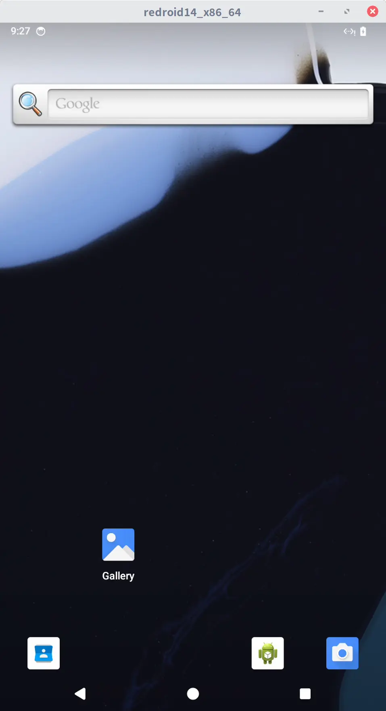
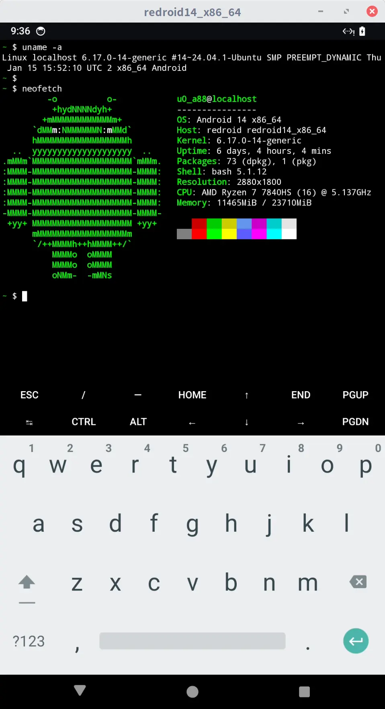
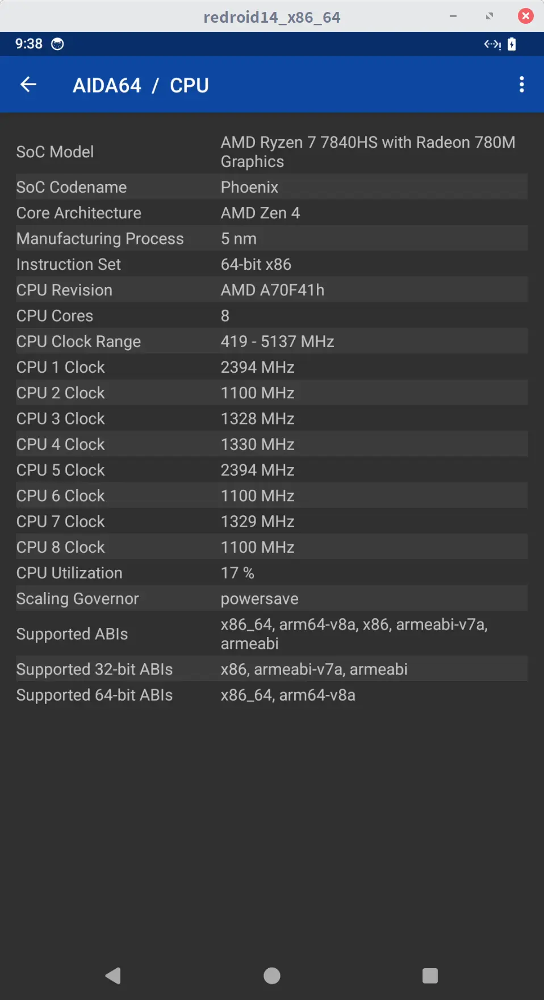

Also see my previous post: [BlissOS as An Android Emulator Under Linux](https://www.gonwan.com/2025/07/28/blissos-as-an-android-emulator-under-linux).

`Redroid`(Remote-Android) is a docker-based solution for Android emulation, GPU enabled, super fast. It is also easy to deploy and use.

What is the difference between `Waydroid`? `Redroid` runs in docker, it won't pollute your host environment with `Waydroid` packages. `Redroid` also supports remote access, while `Waydroid` does not. You can even build a cloud environment above it. Though, `Waydroid` should provide better performance, since no video encoding/decoding and redirection exist.

I'm using LinuxMint 22 / Ubuntu 24.04. Should also work under other Linux OS. Android 12 and 14 are verified to work.

### 1. Pull Redroid Docker Images

```bash
$ docker pull redroid/redroid:14.0.0-latest
```

If you are in Mainland China, edit `/usr/lib/systemd/system/docker.service` to add a proxy for docker repository:

```ini
[Service]
Environment="HTTPS_PROXY=http://127.0.0.1:10809"
...
```

Restart docker service:
```bash
$ sudo systemctl daemon-reload
$ sudo systemctl restart docker
```

### 2. Install libhoudini and Magisk

`libhoudini` provides a translation layer from `Arm` to `x86`, while `Magisk` provides root access.

```bash
$ git clone https://github.com/ayasa520/redroid-script
$ cd redroid-script
$ ./redroid.py -a 14.0.0 -i -m
```

A new docker image is built with `libhoudini` and `Magisk` added.

```bash
$ docker images
REPOSITORY        TAG                     IMAGE ID       CREATED             SIZE
redroid/redroid   14.0.0_houdini_magisk   e250d0ca87c5   About an hour ago   2.34GB
redroid/redroid   14.0.0-latest           639792975c26   21 months ago       2.09GB
```

The readme file says `libhoudini` does not work. But it actually works, after [this PR](https://github.com/ayasa520/redroid-script/pull/37) fixing the linker namespace issue. More details can be found [here](https://xtremedev.top/Android/243.html), in Chinese.

### 3. Run

```bash
$ sudo apt-get install linux-modules-extra-`uname -r`
$ sudo modprobe binder_linux devices="binder,hwbinder,vndbinder"
$ docker run -itd --rm --privileged \
    -v ~/data:/data \
    -p 5555:5555 \
    redroid/redroid:14.0.0_houdini_magisk \
    androidboot.redroid_width=1080 \
    androidboot.redroid_height=1920 \
    androidboot.redroid_gpu_mode=host \
    androidboot.use_memfd=true \
    ro.product.cpu.abilist=x86_64,arm64-v8a,x86,armeabi-v7a,armeabi \
    ro.product.cpu.abilist64=x86_64,arm64-v8a \
    ro.product.cpu.abilist32=x86,armeabi-v7a,armeabi \
    ro.dalvik.vm.isa.arm=x86 \
    ro.dalvik.vm.isa.arm64=x86_64 \
    ro.enable.native.bridge.exec=1 \
    ro.vendor.enable.native.bridge.exec=1 \
    ro.vendor.enable.native.bridge.exec64=1 \
    ro.dalvik.vm.native.bridge=libhoudini.so
```

Download [`scrcpy`](https://github.com/Genymobile/scrcpy) to view your Android OS:

```bash
$ wget https://github.com/Genymobile/scrcpy/releases/download/v3.3.4/scrcpy-linux-x86_64-v3.3.4.tar.gz
$ tar xzvf scrcpy-linux-x86_64-v3.3.4.tar.gz
$ cd scrcpy-linux-x86_64-v3.3.4
$ ./adb connect localhost:5555 &
$ ./scrcpy -s localhost:5555 --audio-codec=aac --audio-encoder=OMX.google.aac.encoder &
```

The Android OS should now appear. Open the `Magisk` app. It will reboot to finish installation.

### 4. Install Apps and Games

```bash
$ ./adb install some_app.apk
```

With [aida64](https://www.aida64.com/downloads/latesta64droid) and [termux](https://github.com/termux/termux-app) showing system info:

|  |  |
| ---------------------------------------------------- | ---------------------------------------------------- |
|  |  |

Note: I set `androidboot.redroid_gpu_mode=host` to pass through the host GPU, which dramatically improves the graphic performance. Surprisingly, it also has add `Vulkan` support. Otherwise, `SwiftShader` or `LLVM`-based software render is used.

If you have an Nvidia GPU, hardware acceleration is likely to fail. See [here](https://github.com/remote-android/redroid-doc/issues/282) for details. The `virtio-gpu` approach are recommended by the author.

The issue previously mentioned is also resolved. When playing `阴阳师`(Chinese version of [Onmyoji](https://play.google.com/store/apps/details?id=com.netease.onmyoji.gb&hl=en_US)), all maps do not load. I was finally able to collect the detailed logs:
```plain
02-21 18:22:02.276  4522  4649 I [18:22:02.276] M: [UIManager] openUI MapGuild
02-21 18:22:02.289  4522  4649 I [18:22:02.289] M: [MapManager] createMapView size (1920.0, 1080.0), init_lat 31.32253721571831, init_lng 121.45974425804117, init_altitude 17
02-21 18:22:02.300  4522  4649 W System.err: java.lang.UnsatisfiedLinkError: dlopen failed: "/data/app/~~Q9WxXLThl_RFQ0m11zDw4w==/com.netease.onmyoji.wyzymnqsd_cps-1NPxTDts0hEOW_vq1dzUIQ==/lib/x86_64/libGNaviUtils.so" is for EM_AARCH64 (183) instead of EM_X86_64 (62)
02-21 18:22:02.300  4522  4649 W System.err: 	at java.lang.Runtime.loadLibrary0(Runtime.java:1077)
02-21 18:22:02.300  4522  4649 W System.err: 	at java.lang.Runtime.loadLibrary0(Runtime.java:998)
02-21 18:22:02.300  4522  4649 W System.err: 	at java.lang.System.loadLibrary(System.java:1656)
02-21 18:22:02.300  4522  4649 W System.err: 	at com.autonavi.amap.mapcore.AEUtil.<clinit>(Unknown Source:2)
02-21 18:22:02.300  4522  4649 W System.err: 	at com.autonavi.amap.mapcore.AEUtil.init(Unknown Source:0)
02-21 18:22:02.300  4522  4649 W System.err: 	at com.amap.api.mapcore.util.a.<init>(Unknown Source:286)
02-21 18:22:02.300  4522  4649 W System.err: 	at com.amap.api.mapcore.util.b.<init>(Unknown Source:11)
02-21 18:22:02.300  4522  4649 W System.err: 	at com.amap.api.mapcore.util.b.<init>(Unknown Source:1)
02-21 18:22:02.300  4522  4649 W System.err: 	at com.amap.api.mapcore.util.o.getMap(Unknown Source:132)
02-21 18:22:02.300  4522  4649 W System.err: 	at com.amap.api.maps.UnityGLRenderer.getMap(Unknown Source:4)
02-21 18:22:02.300  4522  4649 W System.err: 	at com.amap.api.maps.UnityGLRenderer.setContext(Unknown Source:20)
02-21 18:22:02.300  4522  4649 W System.err: 	at com.netease.neox.NXMapViewContainer.<init>(Unknown Source:65)
02-21 18:22:02.300  4522  4649 W System.err: 	at com.netease.neox.PluginMapView.create(Unknown Source:12)
02-21 18:22:02.300  4522  4649 E NeoX    : 
02-21 18:22:02.300  4522  4649 E NeoX    : ERROR *****************************************************************************
02-21 18:22:02.300  4522  4649 E [18:22:02.300] M [ANDROID]: JNIManager Failed to call method create with signiture (I)Lcom/netease/neox/NXMapViewContainer;!
02-21 18:22:02.300  4522  4649 E NeoX    : 
02-21 18:22:02.300  4522  4649 E NeoX    : 
02-21 18:22:02.300  4522  4649 E NeoX    : ERROR *****************************************************************************
02-21 18:22:02.301  4522  4649 E [18:22:02.301] M: create mapview error
02-21 18:22:02.301  4522  4649 E NeoX    : 
02-21 18:22:02.301  4522  4649 I NeoX    : 
02-21 18:22:02.301  4522  4649 I NeoX    : SCRIPT ERROR **********************************************************************
```

They are packaging `*.so` with mismatching architectures, WTF. Seems `AutoNavi` does not provide a `x86_64` SDK for Android. Not knowing how `MumuPlayer` workaround this.

After installing the normal version(`arm64` ABI), all maps can be loaded. The game just looks like a native Linux application. Redroid is now the best Android emulator for Linux.


