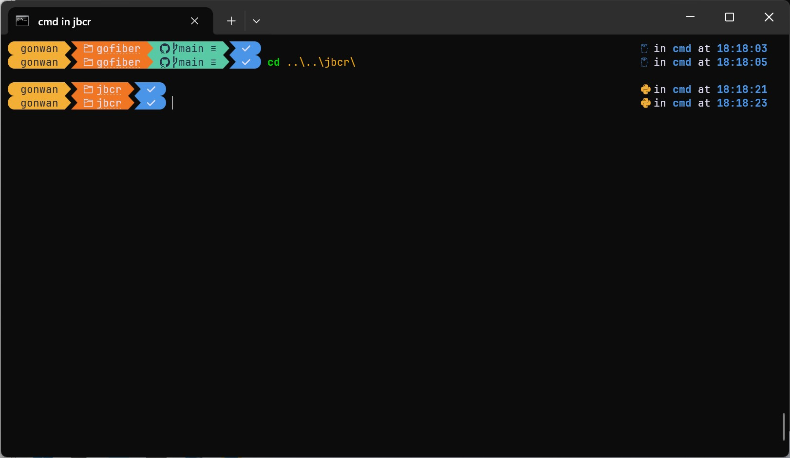

### 1. Install Microsoft Store

If you are using Enterprise or IoT Enterprise version of Windows 11, there is no Microsoft Store preinstalled. Install it with:

```cmd
$ wsreset -i
```

#### 1.1 `winget`

Also `winget` is not preinstalled. You can not find it directly in the store. Go to [App Installer](https://apps.microsoft.com/detail/9nblggh4nns1) and redirect from there.

#### 1.2 `Windows Terminal`

Just search and install it inside the store.

### 2. Install Development Tools

Before installing any tools using `winget`, open `cmd` with administrative privilege:

```cmd
$ winget settings --enable ProxyCommandLineOptions
```

This will allow proxy usage for `winget` in command line. Verify it with:

```cmd
$ winget info
C:\Users\gonwan>winget --info
...
Admin Setting                             State
--------------------------------------------------
LocalManifestFiles                        Disabled
BypassCertificatePinningForMicrosoftStore Disabled
InstallerHashOverride                     Disabled
LocalArchiveMalwareScanOverride           Disabled
ProxyCommandLineOptions                   Enabled
DefaultProxy                              Disabled
```

#### 2.1 `Clink`

[`Clink`](https://github.com/chrisant996/clink) adds command completion, history, and line-editing capabilities for `cmd`. Install with:

```cmd
$ winget install --id chrisant996.Clink [--proxy http://127.0.0.1:10809]
```

Use a proxy if necessary. `Clink` takes effect automatically every time you start `cmd`.

#### 2.2 `Oh-My-Posh`

[`Oh-My-Posh`](https://github.com/jandedobbeleer/oh-my-posh) is a prompt theme, like [`powerline`](https://github.com/powerline/powerline).  It is chosen because it works in almost all shells. Install with:

```cmd
$ winget install --id JanDeDobbeleer.OhMyPosh [--proxy http://127.0.0.1:10809]
```

`Clink` has builtin support for `Oh My Posh`. It allows you to set the prompt using the `clink` command:

```cmd
$ clink config prompt use oh-my-posh
```

For `powershell` to work, follow their [documents](https://ohmyposh.dev/docs/installation/prompt?shell=powershell).

#### 2.3 Nerd Fonts

`Nerd Fonts` patches developer targeted fonts with a high number of glyphs (icons). Install with:

```cmd
$ winget install --id DEVCOM.JetBrainsMonoNerdFont [--proxy http://127.0.0.1:10809]
```

You can find 6 fonts from `Jetbrains`, with and without ligatures.

- `JetBrainsMono Nerd Font`, `JetBrainsMono Nerd Font Mono`, `JetBrainsMono Nerd Font Propo`.
- `JetBrainsMonoNL Nerd Font`, `JetBrainsMonoNL Nerd Font Mono`, `JetBrainsMonoNL Nerd Font Propo`.

Fonts without `Mono` suffix have bigger icons (usually around 1.5 normal letters wide). It works better with `oh-my-posh`. Just choose `JetBrainsMonoNL Nerd Font` in the settings of `Windows Terminal`.

Now your terminal looks more productive. It also shows git and language info in its prompt.



#### 2.4 `Neovim`

Install with:

```cmd
$ winget install Neovim [--proxy http://127.0.0.1:10809]
```

### 3. Upgrade Apps

Upgrade with:

```cmd
$ winget upgrade --id chrisant996.Clink [--proxy http://127.0.0.1:10809]
```

